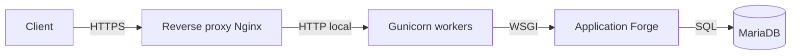

# Mise en production pas à pas

Ce parcours déroule **le** chemin officiel de mise en production de Forge, de zéro à une solution fiable.
Il enchaîne des étapes précises ; chacune renvoie à la page de référence correspondante pour le détail.

Le chemin canonique unique est : **reverse proxy HTTPS → Gunicorn (WSGI) → Forge → MariaDB**.
Le serveur de développement (`forge run`, `python app.py`) n'est pas destiné à l'exposition publique.
Voir [Limites de production](/docs/forge/deployment/production-limits/) pour le pourquoi.



!!! info "Pré-requis"
    Une application Forge fonctionnelle, un serveur Linux Debian ou Ubuntu avec un accès `sudo`,
    et un nom de domaine pointant vers ce serveur.

---

## 1. Préparer le serveur

Installez les paquets système, puis créez un utilisateur dédié sans privilèges.

```bash
sudo apt update
sudo apt install -y python3-venv python3-dev build-essential libmariadb-dev mariadb-server nginx
sudo adduser --system --group forge
sudo mkdir -p /srv/forge && sudo chown forge:forge /srv/forge
```

`libmariadb-dev` fournit `mariadb_config`, requis pour compiler le paquet Python `mariadb`.

---

## 2. Récupérer et vérifier le projet

Placez le projet sous `/srv/forge/mon_app`, créez l'environnement virtuel et installez les dépendances.

```bash
cd /srv/forge/mon_app
python3 -m venv .venv
.venv/bin/pip install -r requirements.txt
```

Avant de déployer, passez les vérifications du projet :

```bash
.venv/bin/forge project:check
.venv/bin/python -m pytest -q
```

---

## 3. Configurer l'environnement de production

Créez `env/prod` à partir de l'exemple, puis restreignez ses permissions.

```bash
cp env/example env/prod
chmod 600 env/prod
```

Variables minimales (le runtime applicatif n'utilise **que** `DB_APP_*`) :

```dotenv
APP_NAME=MonApplication
APP_ENV=prod
APP_ROUTES_MODULE=mvc.routes

DB_NAME=mon_app_db
DB_APP_HOST=localhost
DB_APP_PORT=3306
DB_APP_LOGIN=mon_app_user
DB_APP_PWD=<mot_de_passe_applicatif>

# Compte admin : vide ici. Les secrets DB_ADMIN_* vivent dans
# env/db-admin.local (non commité), réservés au provisioning.
DB_ADMIN_HOST=
DB_ADMIN_PORT=3306
DB_ADMIN_LOGIN=
DB_ADMIN_PWD=

# Derrière un reverse proxy : déclarer les proxys de confiance pour que
# Forge lise correctement l'IP client (X-Forwarded-For).
APP_TRUSTED_PROXIES=127.0.0.1

APP_HOST=127.0.0.1
APP_PORT=8000
APP_SSL_ENABLED=false

UPLOAD_ROOT=storage/uploads
UPLOAD_MAX_SIZE=5242880
```

`APP_SSL_ENABLED=false` : Nginx termine HTTPS, Forge écoute en HTTP local.
La politique de stockage des secrets admin est détaillée dans [Sécurité en production](/docs/forge/deployment/production-security/).

---

## 4. Créer la base MariaDB

Créez la base et un compte applicatif au privilège minimal.

```sql
-- Connecté en root MariaDB
CREATE DATABASE mon_app_db CHARACTER SET utf8mb4 COLLATE utf8mb4_unicode_ci;
CREATE USER 'mon_app_user'@'localhost' IDENTIFIED BY 'mot_de_passe_applicatif';
GRANT SELECT, INSERT, UPDATE, DELETE ON mon_app_db.* TO 'mon_app_user'@'localhost';
FLUSH PRIVILEGES;
```

Le provisioning (`db:init`) a besoin des identifiants admin, qui vivent dans `env/db-admin.local`.
Chargez-les le temps de la commande, puis créez les tables :

```bash
export $(grep -v '^#' env/db-admin.local | xargs)
.venv/bin/forge db:init
```

Les migrations ultérieures et les sauvegardes sont décrites dans [Déploiement avancé](/docs/forge/deployment/deploy-advanced/).

---

## 5. Générer les fichiers de déploiement

`forge deploy:init` produit le point d'entrée WSGI et les modèles d'infrastructure.

```bash
.venv/bin/forge deploy:init
```

| Fichier généré | Rôle |
|---|---|
| `wsgi.py` | Point d'entrée WSGI servi par Gunicorn |
| `deploy/systemd/forge-app.service` | Unité systemd (daemon Gunicorn) |
| `deploy/nginx/forge-app.conf` | Configuration Nginx (reverse proxy) |
| `deploy/README_DEPLOY.md` | Aide-mémoire des étapes |

Le détail du point d'entrée est documenté dans [Déploiement WSGI minimal](/docs/forge/deployment/wsgi-deployment/).

---

## 6. Servir avec Gunicorn

Installez Gunicorn dans l'environnement virtuel, puis testez le service à la main.

```bash
.venv/bin/pip install gunicorn
.venv/bin/gunicorn wsgi:application --workers 4 --bind 127.0.0.1:8000
```

Ajustez `--workers` selon le nombre de cœurs (règle simple : 2 × cœurs + 1).

En multi-processus, les sessions doivent être **partagées** entre workers : utilisez le store MariaDB.
Créez la table `forge_sessions` (voir `mvc/models/sql/forge_sessions.sql`), puis éditez `wsgi.py` :

```python
# wsgi.py
import core.forge as forge
from core.sessions.mariadb_store import MariaDbSessionStore
from core.app.wsgi import create_configured_wsgi_app

forge.configure(session_store=MariaDbSessionStore())
application = create_configured_wsgi_app()
```

`forge.configure(session_store=...)` ne réécrit que cette clé ; la factory applique ensuite le reste de `config.py`.
Sans cela, chaque worker garderait ses sessions en mémoire et l'utilisateur serait déconnecté au hasard.

---

## 7. Installer le service systemd

Copiez l'unité générée, en l'adaptant (`User`, nombre de workers), puis activez le service.

```bash
sudo cp deploy/systemd/forge-app.service /etc/systemd/system/
sudo systemctl daemon-reload
sudo systemctl enable --now forge-app
systemctl status forge-app
```

Les logs suivent journald :

```bash
journalctl -u forge-app -f
```

---

## 8. Reverse proxy HTTPS et pare-feu

Installez la configuration Nginx, activez le site, puis obtenez un certificat TLS avec Certbot.

```bash
sudo cp deploy/nginx/forge-app.conf /etc/nginx/sites-available/
# Renseigner server_name avec votre domaine dans le fichier copié.
sudo ln -s /etc/nginx/sites-available/forge-app.conf /etc/nginx/sites-enabled/
sudo nginx -t && sudo systemctl reload nginx

sudo apt install -y certbot python3-certbot-nginx
sudo certbot --nginx -d exemple.com
```

Certbot ajoute la configuration TLS et la redirection HTTP vers HTTPS.
C'est le **reverse proxy** qui ajoute l'en-tête HSTS sur le trafic public ;
le détail des en-têtes est dans [Déploiement WSGI minimal](/docs/forge/deployment/wsgi-deployment/) et [Sécurité en production](/docs/forge/deployment/production-security/).

Fermez l'accès direct au port applicatif : seul Nginx (HTTPS) doit être exposé.

```bash
sudo ufw allow OpenSSH
sudo ufw allow 'Nginx Full'
sudo ufw enable
```

Le port 8000 reste sur la boucle locale (`127.0.0.1`), jamais exposé publiquement.

---

## 9. Statiques, uploads et médias

Servez les fichiers statiques par Nginx et protégez le dossier de stockage.
La stratégie complète (bloc `location /static/`, permissions `storage/`) est dans [Déploiement avancé](/docs/forge/deployment/deploy-advanced/).

---

## 10. Sécuriser l'application

La page [Sécurité en production](/docs/forge/deployment/production-security/) est la référence : cookies `__Host-`, CSP, CSRF,
RBAC, limitation de débit des uploads, journaux d'audit, secrets et base de données à moindre privilège.
Parcourez sa checklist sécurité avant l'ouverture au public.

---

## 11. Logs, observabilité et santé

Les journaux applicatifs passent par journald (`journalctl -u forge-app`).
Une sonde de disponibilité est exposée sur `/health` :

```bash
curl -s http://127.0.0.1:8000/health
```

---

## 12. Sauvegardes, mises à jour et rollback

Sauvegardez régulièrement la base et les uploads (procédures dans [Déploiement avancé](/docs/forge/deployment/deploy-advanced/)).

Cycle de mise à jour :

```bash
cd /srv/forge/mon_app
git pull
.venv/bin/pip install -r requirements.txt
.venv/bin/forge project:check
export $(grep -v '^#' env/db-admin.local | xargs)
.venv/bin/forge db:apply
sudo systemctl restart forge-app
```

Rollback en cas de problème : revenir à la version précédente, restaurer la base, redémarrer.

```bash
git checkout <tag_precedent>
.venv/bin/pip install -r requirements.txt
mysql -u root -p mon_app_db < backup_avant_migration_AAAAMMJJ.sql
sudo systemctl restart forge-app
```

---

## Vérification finale

```bash
.venv/bin/forge deploy:check
curl -I https://exemple.com
```

`deploy:check` ne doit plus signaler d'erreur, et la réponse publique doit être servie en HTTPS
avec l'en-tête `Strict-Transport-Security`.
La [Checklist de production](/docs/forge/deployment/production-checklist/) récapitule les points à cocher avant l'ouverture.

---

## Pour aller plus loin

- [Déploiement WSGI minimal](/docs/forge/deployment/wsgi-deployment/) : le point d'entrée, Gunicorn, les en-têtes.
- [Déploiement avancé](/docs/forge/deployment/deploy-advanced/) : statiques, uploads, sauvegardes, dépannage.
- [Sécurité en production](/docs/forge/deployment/production-security/) : durcissement complet.
- [Limites de production](/docs/forge/deployment/production-limits/) : ce que Forge garantit ou non.
- [Checklist de production](/docs/forge/deployment/production-checklist/) : le récapitulatif à cocher.
