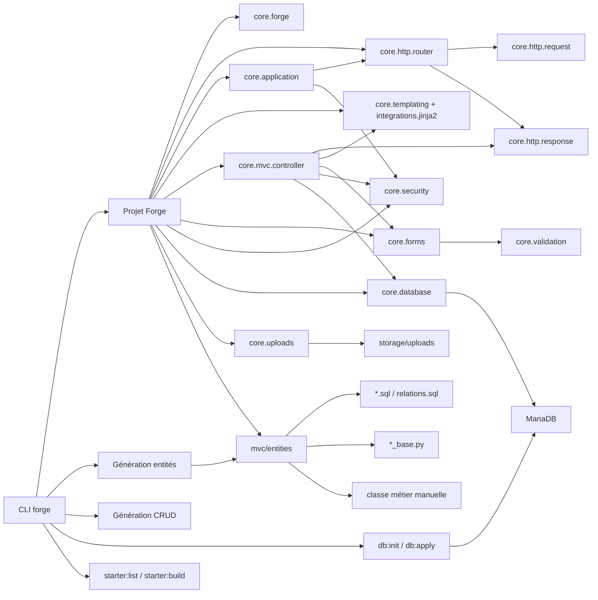

# Forge — Référence API et CLI

[Accueil](index.md) <a href="javascript:void(0)" onclick="window.history.back()">Retour</a>

Cette section décrit l'API publique actuelle de Forge `1.0.0b10`.
Elle est organisée par thème pour faciliter la navigation.

Pour les flux guidés, voir aussi le [guide de démarrage](guide.md),
le [CRUD explicite](crud.md) et l'[architecture des entités](entity_architecture.md).
Pour les décisions d'architecture, voir [ADR-001](adr/001-auth-strategy.md),
[ADR-002](adr/002-session-strategy.md) et les ADR suivants.
Pour ce qui est garanti stable, voir le [contrat de stabilité](stability-contract.md).

## Schéma complet

Voir le schéma complet

---

## Index thématique

### API et CLI

- [API Forge complète](reference/api.md) — fonctions, classes, contrats, helpers
- [CRUD enrichi et relations](reference/crud.md) — relations avancées entre entités
- [Pages publiques](reference/pages-publiques.md) — génération de pages génériques

### Modules officiels

- [Workflow](reference/workflow.md) — statuts et transitions (`forge-mvc-workflow`)
- [Statistiques](reference/stats.md) — tracking d'événements (`forge-mvc-stats`)
- [Modules Forge](reference/modules.md) — système de modules, cycle de vie, routes
- [Auth — Challenge MFA](reference/auth-mfa.md) — flux MFA à la connexion (`forge-mvc-mfa`)

### Sécurité et sessions

- [Audit Auth](reference/audit-auth.md) — journalisation, cookies, headers, uploads
- [Sessions](reference/sessions.md) — concurrence et garanties

### Outils et infrastructure

- [Profils de projet](reference/profils.md) — environnements et endpoint de santé
- [Tests E2E](reference/tests-e2e.md) — HTTP, MariaDB, CSRF

---

## Modules officiels

Les modules suivants sont distribués séparément du core :

| Module | Paquet PyPI | README |
|---|---|---|
| MFA | `forge-mvc-mfa` | `packages/forge-mvc-mfa/README.md` |
| RBAC | `forge-mvc-rbac` | `packages/forge-mvc-rbac/README.md` |
| Workflow | `forge-mvc-workflow` | `packages/forge-mvc-workflow/README.md` |
| Statistiques | `forge-mvc-stats` | `packages/forge-mvc-stats/README.md` |

Les pages de référence ci-dessus documentent l'API publique de ces modules
pour mémoire. Pour l'installation, l'usage applicatif et les exemples,
voir le README de chaque module.

---

**Note** : cette page est un index. Le contenu détaillé vit dans `docs/reference/`.
Si un lien est cassé ou un sujet manque, voir le
CHANGELOG et la [roadmap](roadmap/forge-roadmap.md).
