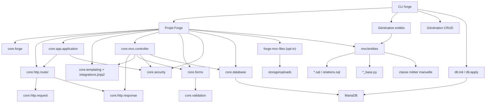

# Schéma API Forge

[Accueil](../index.md) <a href="javascript:void(0)" onclick="window.history.back()">Retour</a>

```mermaid
flowchart TD
    CLI["CLI forge"] --> Project["Projet Forge"]
    CLI --> EntityGen["Génération entités"]
    CLI --> CrudGen["Génération CRUD"]
    CLI --> DbTools["db:init / db:apply"]

    Project --> CoreConfig["core.forge"]
    Project --> Router["core.http.router"]
    Project --> App["core.app.application"]
    Project --> Templates["core.templating + integrations.jinja2"]
    Project --> Controllers["core.mvc.controller"]
    Project --> Forms["core.forms"]
    Project --> Security["core.security"]
    Project --> Database["core.database"]
    Project --> Uploads["forge-mvc-files (opt-in)"]
    Project --> Entities["mvc/entities"]

    App --> Router
    App --> Security
    Router --> Request["core.http.request"]
    Router --> Response["core.http.response"]
    Controllers --> Response
    Controllers --> Templates
    Controllers --> Forms
    Controllers --> Security
    Controllers --> Database
    Forms --> Validation["core.validation"]
    EntityGen --> Entities
    Entities --> GeneratedSql["*.sql / relations.sql"]
    Entities --> GeneratedBase["*_base.py"]
    Entities --> ManualClass["classe métier manuelle"]
    Database --> MariaDB["MariaDB"]
    DbTools --> MariaDB
    Uploads --> Storage["storage/uploads"]
```
