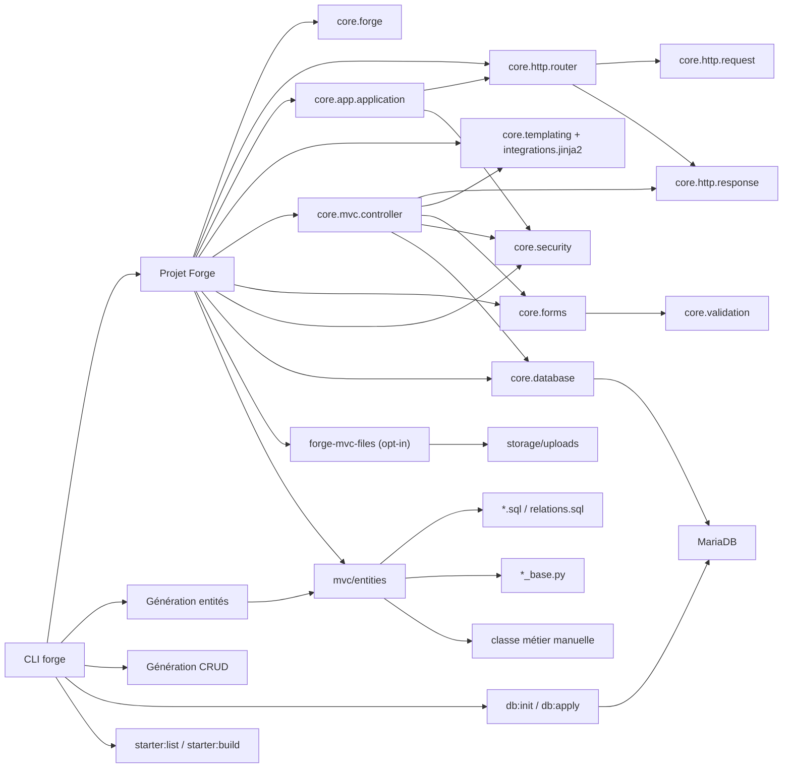

# Forge — Référence API et CLI

[Accueil](../index.md) <a href="javascript:void(0)" onclick="window.history.back()">Retour</a>

Cette section décrit l'API publique actuelle de Forge `1.0.0b13`.
Elle est organisée par thème pour faciliter la navigation.

Pour les flux guidés, voir aussi le [guide de démarrage](/docs/forge/guide/guide/),
le [CRUD explicite](/docs/forge/features/crud/) et l'[architecture des entités](/docs/forge/features/entity_architecture/).
Pour les décisions d'architecture, voir [ADR-001](/docs/forge/adr/001-auth-strategy/),
[ADR-002](/docs/forge/adr/002-session-strategy/) et l'[index des ADR](/docs/forge/adr/).
Pour ce qui est garanti stable, voir le [contrat de stabilité](/docs/forge/release/stability-contract/).

## Schéma complet

Voir le schéma complet

---

## Index thématique

### API et CLI

- [API Forge complète](/docs/forge/reference/api/) — fonctions, classes, contrats, helpers
- [CRUD enrichi et relations](/docs/forge/reference/crud/) — relations avancées entre entités
- [Pages publiques](/docs/forge/reference/pages-publiques/) — génération de pages génériques

### Opt-ins officiels

- [Workflow](/docs/forge/reference/workflow/) — statuts et transitions (`forge-mvc-workflow`)
- [Statistiques](/docs/forge/reference/stats/) — tracking d'événements (`forge-mvc-stats`)
- [Modules Forge](/docs/forge/reference/modules/) — système de modules, cycle de vie, routes
- [Auth — Challenge MFA](/docs/forge/reference/auth-mfa/) — flux MFA à la connexion (`forge-mvc-mfa`)

### Sécurité et sessions

- [Audit Auth](/docs/forge/reference/audit-auth/) — journalisation, cookies, headers, uploads
- [Sessions](/docs/forge/reference/sessions/) — concurrence et garanties

### Outils et infrastructure

- [Profils de projet](/docs/forge/reference/profils/) — environnements et endpoint de santé
- [Tests E2E](/docs/forge/reference/tests-e2e/) — HTTP, MariaDB, CSRF

---

## Opt-ins officiels

Les opt-ins suivants sont distribués séparément du core :

| Opt-in | Paquet PyPI | README |
|---|---|---|
| MFA | `forge-mvc-mfa` | `packages/forge-mvc-mfa/README.md` |
| RBAC | `forge-mvc-rbac` | `packages/forge-mvc-rbac/README.md` |
| Workflow | `forge-mvc-workflow` | `packages/forge-mvc-workflow/README.md` |
| Statistiques | `forge-mvc-stats` | `packages/forge-mvc-stats/README.md` |

Les pages de référence ci-dessus documentent l'API publique de ces opt-ins
pour mémoire. Pour l'installation, l'usage applicatif et les exemples,
voir le README de chaque opt-in.

---

**Note** : cette page est un index. Le contenu détaillé vit dans `docs/reference/`.
Si un lien est cassé ou un sujet manque, voir le
CHANGELOG et la [roadmap](/docs/forge/roadmap/forge-roadmap/).
