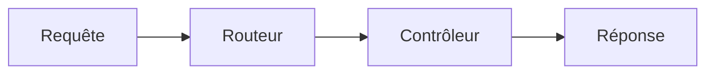

# Diagrammes et inclusions

**Objectif** : illustrer le cycle d'une requête Forge par un schéma, et apprendre à inclure un fichier d'exemple.

**Ce que vous allez apprendre :** les diagrammes Mermaid (`pymdownx.superfences`) et l'inclusion de fichiers (`pymdownx.snippets`).

Votre page explique l'installation et les commandes.

Nous ajoutons un schéma du cycle requête → contrôleur → réponse, puis nous voyons comment inclure une vraie source de code.

## Un diagramme Mermaid

Une clôture `mermaid` (fence personnalisée déclarée dans `mkdocs.yml`) trace un diagramme à partir d'une description textuelle.

````md

````

Rendu :


## Inclure un fichier

L'extension `snippets` insère le contenu d'un autre fichier avec la directive `--8<--`.

~~~md
--8<-- "exemples/welcome_controller.py"
~~~

C'est précieux en documentation : on inclut un **vrai** fichier d'exemple, testé et à jour, plutôt que d'en recopier le contenu, qui se périmerait.

## Ajoutez à votre page

Ajoutez une section « Comment ça marche » à `prise-en-main.md`, avec le diagramme du cycle :

~~~md
## Comment ça marche


~~~

## À retenir

- Une clôture `mermaid` trace un diagramme depuis une description textuelle.
- `--8<-- "fichier"` inclut le contenu d'un fichier réel (`snippets`).
- Inclure plutôt que recopier garde une seule source de vérité.

[Continuer avec Le texte enrichi](/docs/forge/starters/welcome-markdown/avance/texte-enrichi/)
