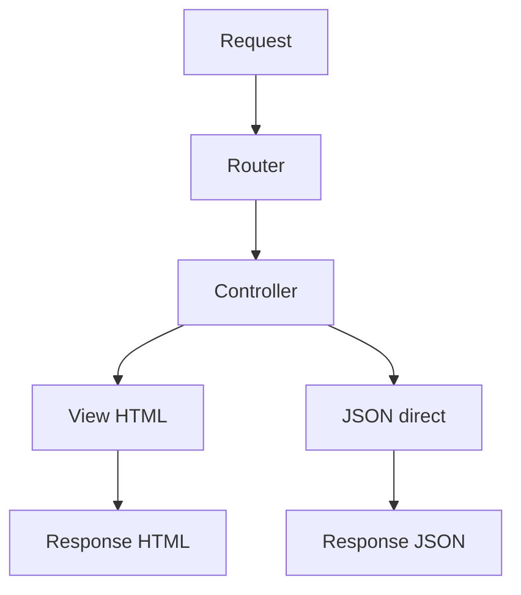
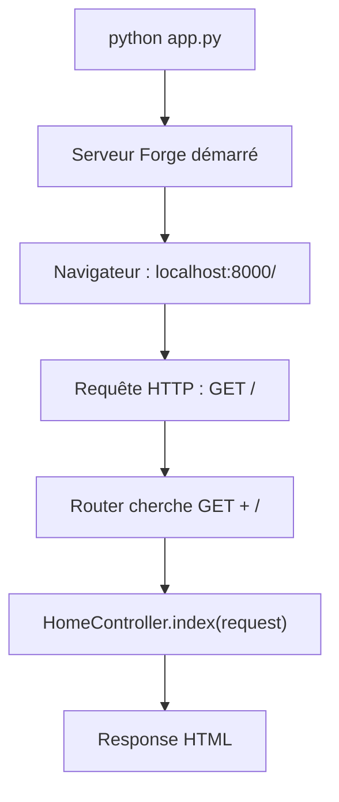
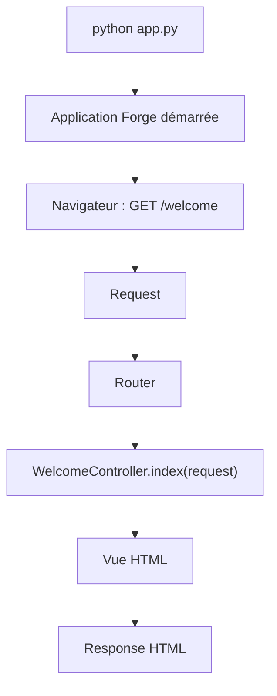
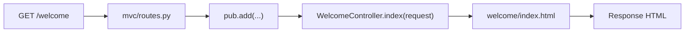

# Premier pas — Bienvenue dans Forge

> Ce starter est le point d'entrée recommandé pour découvrir Forge sans base de données.

!!! tip "Aucun risque pour commencer"
    Ce starter ne crée aucune table, ne lance aucune migration et ne demande aucune base de données.
    Il sert uniquement à comprendre comment Forge traite une requête HTTP.

Sans SQL. Sans base de données. Sans entité. Sans migration. Sans CRUD.

Référence technique : ce starter reste le **Starter 7** dans la CLI Forge.

## Les deux cycles HTTP Forge

Une requête Forge suit toujours le même début : elle devient une `Request`, le `Router` cherche une route, puis Forge appelle la méthode de contrôleur déclarée. Ensuite, le contrôleur choisit ce qu'il retourne.

=== "Cycle HTML"

    ```mermaid
    flowchart LR
        A["Request"] --> B["Router"]
        B --> C["Controller"]
        C --> D["View HTML"]
        D --> E["Response HTML"]
    ```

    !!! success "Cycle HTML — page rendue au navigateur"
        Le contrôleur demande le rendu d'une vue HTML. Forge construit ensuite une réponse HTML envoyée au navigateur.

        Dans ce starter, c'est le cycle réellement exécuté par les six routes `/welcome`.

=== "Cycle JSON"

    ```mermaid
    flowchart LR
        A["Request"] --> B["Router"]
        B --> C["Controller"]
        C --> D["Response JSON"]
    ```

    !!! info "Cycle JSON — données renvoyées directement"
        Le contrôleur peut aussi retourner directement une réponse JSON. Dans ce cas, aucune View HTML n'est nécessaire.

        Ce starter explique ce principe, mais il **n'expose pas de route JSON dédiée**.



Ce schéma compare les deux sorties possibles : une réponse HTML passe par une vue, alors qu'une réponse JSON peut être produite directement par le contrôleur.

## Où intervient `app.py` ?

`app.py` est le point d'entrée de l'application Forge en développement.

Quand vous lancez :

```bash
python app.py
```

Forge démarre l'application, charge la configuration utile, prépare le routage et attend les requêtes HTTP.

`app.py` ne contient pas la logique de la page `/welcome`. Il démarre l'application. Ensuite, quand le navigateur demande `/welcome`, Forge reçoit la requête HTTP transmise par le serveur de développement, construit une `Request`, puis la transmet au `Router`.

### `app.py` ne choisit pas la route `/`

Quand on lance :

```bash
python app.py
```

Forge démarre l'application et le serveur de développement.

À ce moment-là, aucune page n'est encore choisie.

La route `/` est appelée ensuite parce que le navigateur demande l'adresse :

```text
localhost:8000/
```

Cette demande produit une requête HTTP :

```text
GET /
```

Forge reçoit alors cette requête, puis le routeur cherche une route correspondant à :

```text
méthode : GET
chemin  : /
```

Dans ce projet Forge, une route réelle existe dans `mvc/routes.py` :

```python
pub.add("GET", "/", HomeController.index, name="home")
```

Forge appelle alors :

```python
HomeController.index(request)
```

La méthode du contrôleur construit ensuite une réponse, que Forge renvoie au navigateur.



En résumé : `app.py` démarre Forge. Le navigateur demande une URL. Le routeur choisit le contrôleur. Le contrôleur produit la réponse.




## Comment Forge exécute le contrôleur ?

Ce n'est pas la classe seule qui s'exécute. Forge appelle une méthode précise de cette classe quand une route correspond à la requête.



Dans le fichier réel, l'alignement contient des espaces pour rendre les six routes lisibles, mais le lien important reste celui-ci : `/welcome` appelle `WelcomeController.index`.

## Si vous venez d’un autre framework

Ces repères servent uniquement à traduire le vocabulaire. Forge ne cherche pas à copier Symfony ou Django : il garde un flux volontairement explicite.

=== "Symfony"

    Dans Symfony, une route appelle une action de contrôleur.

    Dans Forge, le principe est proche, mais volontairement explicite :

    - `WelcomeController` est la classe contrôleur ;
    - `index(request)` est l’action appelée ;
    - la route dans `mvc/routes.py` relie l’URL à cette action ;
    - la méthode retourne une réponse Forge ;
    - Forge construit ensuite la réponse HTTP.

    Exemple Forge :

    ```python
    pub.add("GET", "/welcome", WelcomeController.index, name="welcome_index")
    ```

    Ce lien signifie :

    ```text
    GET /welcome
        ↓
    Router
        ↓
    WelcomeController.index(request)
        ↓
    vue HTML ou réponse JSON
    ```

    Dans ce starter Forge, le lien route → méthode est visible directement dans `mvc/routes.py`.

=== "Django"

    Django parle souvent d’architecture MTV :

    - `Model` : les données ;
    - `Template` : le rendu HTML ;
    - `View` : la fonction ou classe Python qui traite la requête.

    Dans Forge, le vocabulaire est volontairement plus proche du MVC classique :

    - `Model` : les données ;
    - `View` : le fichier HTML rendu ;
    - `Controller` : la classe Python qui reçoit la requête et prépare la réponse.

    Donc ce que Django appelle souvent une `view` ressemble davantage, dans Forge, à une méthode de contrôleur.

    Exemple Forge :

    ```python
    pub.add("GET", "/welcome", WelcomeController.index, name="welcome_index")
    ```

    Ce lien signifie :

    ```text
    GET /welcome
        ↓
    Router
        ↓
    WelcomeController.index(request)
        ↓
    vue HTML ou réponse JSON
    ```

    La différence importante : Forge garde le lien route → contrôleur → vue très explicite, sans mélanger le rôle du fichier HTML avec celui de la méthode Python.

## Le code complet généré par ce starter

Après ces repères, regardons maintenant le code complet généré par Forge. Le starter tient en trois morceaux : les routes, le contrôleur et six vues HTML.

### 1. Les routes complètes

<details open>
<summary><code>mvc/routes.py</code> — routes injectées par le starter</summary>

```python
# forge-starter:welcome:start
from mvc.controllers.welcome_controller import WelcomeController

with router.group("", public=True) as pub:
    pub.add("GET", "/welcome",           WelcomeController.index,          name="welcome_index")
    pub.add("GET", "/welcome/cycle",     WelcomeController.cycle,          name="welcome_cycle")
    pub.add("GET", "/welcome/request",   WelcomeController.request_example, name="welcome_request")
    pub.add("GET", "/welcome/response",  WelcomeController.response_example, name="welcome_response")
    pub.add("GET", "/welcome/routing",   WelcomeController.routing_example, name="welcome_routing")
    pub.add("GET", "/welcome/404-demo",  WelcomeController.not_found_demo, name="welcome_404_demo")
# forge-starter:welcome:end
```

</details>

Chaque ligne associe une URL à une méthode du contrôleur. Le routeur ne devine rien : le lien entre `GET /welcome/cycle` et `WelcomeController.cycle` est écrit explicitement.

### 2. Le contrôleur complet

<details open>
<summary><code>mvc/controllers/welcome_controller.py</code></summary>

```python
from core.mvc.controller.base_controller import BaseController


class WelcomeController(BaseController):
    """Cycle HTTP illustré — starter d'entrée Forge sans base de données."""

    @staticmethod
    def index(request):
        return BaseController.render("welcome/index.html", request=request)

    @staticmethod
    def cycle(request):
        return BaseController.render("welcome/cycle.html", request=request)

    @staticmethod
    def request_example(request):
        ctx = {
            "method": request.method,
            "path": request.path,
            "params": {k: v[0] if len(v) == 1 else v for k, v in request.params.items()},
        }
        return BaseController.render("welcome/request_example.html", context=ctx, request=request)

    @staticmethod
    def response_example(request):
        return BaseController.render("welcome/response_example.html", request=request)

    @staticmethod
    def routing_example(request):
        return BaseController.render("welcome/routing_example.html", request=request)

    @staticmethod
    def not_found_demo(request):
        return BaseController.render("welcome/not_found_demo.html", request=request)
```

</details>

Chaque méthode correspond à une route. Chaque méthode retourne une réponse Forge. Dans ce starter, les méthodes retournent principalement des vues HTML avec `BaseController.render(...)`.

### 3. Les 6 vues complètes

Ce starter contient une classe contrôleur principale, `WelcomeController`, et six vues HTML — une par route. Les vues ci-dessous sont les fichiers HTML complets réellement copiés dans `mvc/views/welcome/`.

!!! note "Vues volontairement simples"
    Dans ce premier starter, les vues sont volontairement des fichiers HTML complets.

    Elles n'utilisent pas encore :

    - `base.html` ;
    - `` ;
    - `` ;
    - ``.

    Ces mécanismes seront introduits plus tard. Ici, l'objectif est d'abord de comprendre le trajet :

    route → contrôleur → vue → réponse.

<details open>
<summary><code>mvc/views/welcome/index.html</code> — route <code>/welcome</code>, méthode <code>WelcomeController.index</code>, vue <code>welcome/index.html</code></summary>

```html
<!DOCTYPE html>
<html lang="fr">
<head>
  <meta charset="UTF-8">
  <meta name="viewport" content="width=device-width, initial-scale=1.0">
  <title>Bienvenue — Forge</title>
  <link rel="stylesheet" href="/static/tailwind.css">
</head>
<body class="bg-gray-950 text-gray-100 min-h-screen font-sans">

  <header class="border-b border-gray-800 px-8 py-4 flex items-center justify-between">
    <div class="flex items-center gap-3">
      <svg class="w-6 h-6 text-orange-400" fill="none" stroke="currentColor" stroke-width="1.8" viewBox="0 0 24 24">
        <path stroke-linecap="round" stroke-linejoin="round" d="M15.362 5.214A8.252 8.252 0 0 1 12 21 8.25 8.25 0 0 1 6.038 7.047 8.287 8.287 0 0 0 9 9.601a8.983 8.983 0 0 1 3.361-6.867 8.21 8.21 0 0 0 3 2.48Z"/>
        <path stroke-linecap="round" stroke-linejoin="round" d="M12 18a3.75 3.75 0 0 0 .495-7.468 5.99 5.99 0 0 0-1.925 3.547 5.975 5.975 0 0 1-2.133-1.001A3.75 3.75 0 0 0 12 18Z"/>
      </svg>
      <span class="font-bold tracking-tight">Forge</span>
      <span class="text-xs bg-gray-800 text-orange-400 px-2 py-0.5 rounded-full">Starter 7 — Bienvenue</span>
    </div>
    <nav class="hidden md:flex items-center gap-5 text-sm">
      <a href="/welcome" class="text-orange-400 font-semibold">Accueil</a>
      <a href="/welcome/cycle" class="text-gray-400 hover:text-white transition-colors">Cycle HTTP</a>
      <a href="/welcome/request" class="text-gray-400 hover:text-white transition-colors">Requête</a>
      <a href="/welcome/response" class="text-gray-400 hover:text-white transition-colors">Réponse</a>
      <a href="/welcome/routing" class="text-gray-400 hover:text-white transition-colors">Routage</a>
      <a href="/welcome/404-demo" class="text-gray-400 hover:text-white transition-colors">404</a>
    </nav>
  </header>

  <main class="max-w-3xl mx-auto px-8 py-16">
    <p class="text-orange-400 text-xs font-mono tracking-widest uppercase mb-4">Framework MVC Python</p>
    <h1 class="text-4xl font-bold mb-4 leading-tight">
      Bienvenue dans <span class="text-orange-400">Forge</span>.
    </h1>
    <p class="text-gray-400 text-lg leading-relaxed mb-6">
      Ce starter illustre le cycle HTTP de Forge sans base de données.
      Chaque page démontre une étape du traitement d'une requête.
    </p>

    <div class="mb-10 p-5 bg-gray-900 border border-gray-800 rounded-xl text-sm space-y-2">
      <p class="text-xs font-mono text-gray-500 uppercase tracking-wide mb-3">Les deux cycles MVC Forge</p>
      <p class="font-mono text-gray-300">Cycle HTML&nbsp;: Request → Router → Controller → <span class="text-green-400">View</span> → Response HTML</p>
      <p class="font-mono text-gray-300">Cycle JSON&nbsp;: Request → Router → Controller → Response JSON</p>
    </div>

    <div class="grid gap-4">

      <a href="/welcome/cycle"
         class="group flex items-start gap-5 bg-gray-900 border border-gray-800 hover:border-orange-500/40 rounded-xl p-6 transition-all">
        <div class="flex-shrink-0 w-10 h-10 rounded-lg bg-orange-500/10 text-orange-400 flex items-center justify-center text-lg font-bold">1</div>
        <div>
          <h2 class="font-semibold text-gray-100 group-hover:text-orange-400 transition-colors mb-1">Cycle HTTP</h2>
          <p class="text-sm text-gray-500">Visualiser les deux cycles : HTML (via View) et JSON (sans View). Comprendre le rôle de chaque étape.</p>
          <p class="text-xs text-orange-400 mt-2 font-mono">GET /welcome/cycle →</p>
        </div>
      </a>

      <a href="/welcome/request"
         class="group flex items-start gap-5 bg-gray-900 border border-gray-800 hover:border-orange-500/40 rounded-xl p-6 transition-all">
        <div class="flex-shrink-0 w-10 h-10 rounded-lg bg-orange-500/10 text-orange-400 flex items-center justify-center text-lg font-bold">2</div>
        <div>
          <h2 class="font-semibold text-gray-100 group-hover:text-orange-400 transition-colors mb-1">L'objet Requête</h2>
          <p class="text-sm text-gray-500">Inspecter en direct les attributs de la requête courante : méthode, chemin, paramètres.</p>
          <p class="text-xs text-orange-400 mt-2 font-mono">GET /welcome/request →</p>
        </div>
      </a>

      <a href="/welcome/response"
         class="group flex items-start gap-5 bg-gray-900 border border-gray-800 hover:border-orange-500/40 rounded-xl p-6 transition-all">
        <div class="flex-shrink-0 w-10 h-10 rounded-lg bg-orange-500/10 text-orange-400 flex items-center justify-center text-lg font-bold">3</div>
        <div>
          <h2 class="font-semibold text-gray-100 group-hover:text-orange-400 transition-colors mb-1">L'objet Réponse</h2>
          <p class="text-sm text-gray-500">Comprendre comment un contrôleur construit et retourne une réponse HTTP.</p>
          <p class="text-xs text-orange-400 mt-2 font-mono">GET /welcome/response →</p>
        </div>
      </a>

      <a href="/welcome/routing"
         class="group flex items-start gap-5 bg-gray-900 border border-gray-800 hover:border-orange-500/40 rounded-xl p-6 transition-all">
        <div class="flex-shrink-0 w-10 h-10 rounded-lg bg-orange-500/10 text-orange-400 flex items-center justify-center text-lg font-bold">4</div>
        <div>
          <h2 class="font-semibold text-gray-100 group-hover:text-orange-400 transition-colors mb-1">Le routeur</h2>
          <p class="text-sm text-gray-500">Voir comment les routes sont déclarées et comment le routeur associe une URL à un contrôleur.</p>
          <p class="text-xs text-orange-400 mt-2 font-mono">GET /welcome/routing →</p>
        </div>
      </a>

      <a href="/welcome/404-demo"
         class="group flex items-start gap-5 bg-gray-900 border border-gray-800 hover:border-orange-500/40 rounded-xl p-6 transition-all">
        <div class="flex-shrink-0 w-10 h-10 rounded-lg bg-orange-500/10 text-orange-400 flex items-center justify-center text-lg font-bold">5</div>
        <div>
          <h2 class="font-semibold text-gray-100 group-hover:text-orange-400 transition-colors mb-1">Gestion des erreurs</h2>
          <p class="text-sm text-gray-500">Comprendre comment Forge gère les routes inconnues et retourne une réponse 404 structurée.</p>
          <p class="text-xs text-orange-400 mt-2 font-mono">GET /welcome/404-demo →</p>
        </div>
      </a>

    </div>

    <div class="mt-16 border-t border-gray-800 pt-8 text-sm text-gray-600">
      <p>Prochaines étapes :
        <a href="https://caucrogegit.github.io/Forge/getting-started/" class="text-orange-400 hover:underline" target="_blank">documentation</a> ·
        <code class="bg-gray-800 px-1.5 py-0.5 rounded text-gray-300 text-xs">forge starter:build 1</code> pour un CRUD complet.
      </p>
    </div>
  </main>

</body>
</html>
```

</details>
<details open>
<summary><code>mvc/views/welcome/cycle.html</code> — route <code>/welcome/cycle</code>, méthode <code>WelcomeController.cycle</code>, vue <code>welcome/cycle.html</code></summary>

```html
<!DOCTYPE html>
<html lang="fr">
<head>
  <meta charset="UTF-8">
  <meta name="viewport" content="width=device-width, initial-scale=1.0">
  <title>Cycle HTTP — Forge</title>
  <link rel="stylesheet" href="/static/tailwind.css">
</head>
<body class="bg-gray-950 text-gray-100 min-h-screen font-sans">

  <header class="border-b border-gray-800 px-8 py-4 flex items-center justify-between">
    <div class="flex items-center gap-3">
      <svg class="w-6 h-6 text-orange-400" fill="none" stroke="currentColor" stroke-width="1.8" viewBox="0 0 24 24">
        <path stroke-linecap="round" stroke-linejoin="round" d="M15.362 5.214A8.252 8.252 0 0 1 12 21 8.25 8.25 0 0 1 6.038 7.047 8.287 8.287 0 0 0 9 9.601a8.983 8.983 0 0 1 3.361-6.867 8.21 8.21 0 0 0 3 2.48Z"/>
        <path stroke-linecap="round" stroke-linejoin="round" d="M12 18a3.75 3.75 0 0 0 .495-7.468 5.99 5.99 0 0 0-1.925 3.547 5.975 5.975 0 0 1-2.133-1.001A3.75 3.75 0 0 0 12 18Z"/>
      </svg>
      <span class="font-bold tracking-tight">Forge</span>
    </div>
    <nav class="hidden md:flex items-center gap-5 text-sm">
      <a href="/welcome" class="text-gray-400 hover:text-white transition-colors">Accueil</a>
      <a href="/welcome/cycle" class="text-orange-400 font-semibold">Cycle HTTP</a>
      <a href="/welcome/request" class="text-gray-400 hover:text-white transition-colors">Requête</a>
      <a href="/welcome/response" class="text-gray-400 hover:text-white transition-colors">Réponse</a>
      <a href="/welcome/routing" class="text-gray-400 hover:text-white transition-colors">Routage</a>
      <a href="/welcome/404-demo" class="text-gray-400 hover:text-white transition-colors">404</a>
    </nav>
  </header>

  <main class="max-w-3xl mx-auto px-8 py-12">
    <h1 class="text-3xl font-bold mb-2">Cycle HTTP</h1>
    <p class="text-gray-400 mb-10">Le traitement d'une requête dans Forge suit toujours le même chemin.</p>

    <div class="space-y-3">

      <div class="flex items-center gap-4 bg-gray-900 border border-gray-800 rounded-xl p-5">
        <div class="flex-shrink-0 w-8 h-8 rounded-full bg-blue-500/20 text-blue-400 text-sm font-bold flex items-center justify-center">1</div>
        <div>
          <p class="font-semibold text-gray-100">Navigateur</p>
          <p class="text-sm text-gray-500 mt-0.5">Envoie une requête HTTP : <code class="text-blue-300 bg-gray-800 px-1 rounded text-xs">GET /welcome/cycle HTTP/1.1</code></p>
        </div>
      </div>

      <div class="flex justify-center text-gray-600 text-xl select-none">↓</div>

      <div class="flex items-center gap-4 bg-gray-900 border border-gray-800 rounded-xl p-5">
        <div class="flex-shrink-0 w-8 h-8 rounded-full bg-orange-500/20 text-orange-400 text-sm font-bold flex items-center justify-center">2</div>
        <div>
          <p class="font-semibold text-gray-100">app.py — Application</p>
          <p class="text-sm text-gray-500 mt-0.5">Reçoit la connexion TCP, parse les en-têtes, crée l'objet <code class="text-orange-300 bg-gray-800 px-1 rounded text-xs">Request</code>.</p>
        </div>
      </div>

      <div class="flex justify-center text-gray-600 text-xl select-none">↓</div>

      <div class="flex items-center gap-4 bg-gray-900 border border-gray-800 rounded-xl p-5">
        <div class="flex-shrink-0 w-8 h-8 rounded-full bg-orange-500/20 text-orange-400 text-sm font-bold flex items-center justify-center">3</div>
        <div>
          <p class="font-semibold text-gray-100">mvc/routes.py — Routeur</p>
          <p class="text-sm text-gray-500 mt-0.5">Cherche la route correspondant à <code class="text-orange-300 bg-gray-800 px-1 rounded text-xs">GET /welcome/cycle</code> et résout le handler.</p>
        </div>
      </div>

      <div class="flex justify-center text-gray-600 text-xl select-none">↓</div>

      <div class="flex items-center gap-4 bg-gray-900 border border-orange-500/30 rounded-xl p-5">
        <div class="flex-shrink-0 w-8 h-8 rounded-full bg-orange-500/30 text-orange-300 text-sm font-bold flex items-center justify-center">4</div>
        <div>
          <p class="font-semibold text-orange-300">WelcomeController.cycle — Vous êtes ici</p>
          <p class="text-sm text-gray-500 mt-0.5">Reçoit la requête, calcule le contexte, appelle <code class="text-orange-300 bg-gray-800 px-1 rounded text-xs">BaseController.render(...)</code>.</p>
        </div>
      </div>

      <div class="flex justify-center text-gray-600 text-xl select-none">↓</div>

      <div class="flex items-center gap-4 bg-gray-900 border border-green-500/30 rounded-xl p-5">
        <div class="flex-shrink-0 w-8 h-8 rounded-full bg-green-500/20 text-green-400 text-sm font-bold flex items-center justify-center">5</div>
        <div>
          <p class="font-semibold text-gray-100">View — Template Jinja2</p>
          <p class="text-sm text-gray-500 mt-0.5">Le contrôleur demande le rendu du template <code class="text-green-300 bg-gray-800 px-1 rounded text-xs">welcome/cycle.html</code>. Jinja2 fusionne le template avec le contexte et produit le HTML final.</p>
          <p class="text-xs text-green-400/60 mt-1.5 font-mono">mvc/views/welcome/cycle.html</p>
        </div>
      </div>

      <div class="flex justify-center text-gray-600 text-xl select-none">↓</div>

      <div class="flex items-center gap-4 bg-gray-900 border border-gray-800 rounded-xl p-5">
        <div class="flex-shrink-0 w-8 h-8 rounded-full bg-blue-500/20 text-blue-400 text-sm font-bold flex items-center justify-center">6</div>
        <div>
          <p class="font-semibold text-gray-100">Response HTML — Navigateur</p>
          <p class="text-sm text-gray-500 mt-0.5">Forge envoie : <code class="text-blue-300 bg-gray-800 px-1 rounded text-xs">HTTP/1.1 200 OK  Content-Type: text/html</code>. Le navigateur affiche la page.</p>
        </div>
      </div>

    </div>

    <div class="mt-8 p-5 bg-green-950/20 border border-green-900/30 rounded-xl">
      <p class="text-xs font-mono text-green-400/80 uppercase tracking-wide mb-2">Cycle HTML complet</p>
      <p class="text-sm text-gray-300 font-mono">Request → Router → Controller → <span class="text-green-400">View</span> → Response HTML</p>
      <p class="text-xs text-gray-500 mt-3">La View est le template HTML/Jinja2 que le contrôleur demande de rendre. C'est elle qui produit le corps de la réponse envoyée au navigateur.</p>
    </div>

    <div class="mt-4 p-5 bg-blue-950/20 border border-blue-900/30 rounded-xl">
      <p class="text-xs font-mono text-blue-400/80 uppercase tracking-wide mb-2">Cycle JSON (sans View)</p>
      <p class="text-sm text-gray-300 font-mono">Request → Router → Controller → Response JSON</p>
      <p class="text-xs text-gray-500 mt-3">Quand le contrôleur retourne un <code class="text-blue-300 bg-gray-900 px-1 rounded text-xs">JSONResponse</code>, il n'y a pas de View. Le contrôleur construit directement la réponse.</p>
    </div>

    <div class="mt-10 bg-gray-900 border border-gray-800 rounded-xl p-6">
      <p class="text-sm font-semibold text-gray-300 mb-3">Code correspondant dans <code class="text-orange-400">mvc/routes.py</code></p>
      <pre class="text-xs font-mono text-green-400 leading-relaxed overflow-x-auto">with router.group("", public=True) as pub:
    pub.add("GET", "/welcome/cycle", WelcomeController.cycle, name="welcome_cycle")</pre>
    </div>

    <div class="mt-6 flex gap-4 text-sm">
      <a href="/welcome" class="text-gray-500 hover:text-white transition-colors">← Accueil</a>
      <a href="/welcome/request" class="text-orange-400 hover:text-orange-300 transition-colors">Requête →</a>
    </div>
  </main>

</body>
</html>
```

</details>
<details open>
<summary><code>mvc/views/welcome/request_example.html</code> — route <code>/welcome/request</code>, méthode <code>WelcomeController.request_example</code>, vue <code>welcome/request_example.html</code></summary>

```html
<!DOCTYPE html>
<html lang="fr">
<head>
  <meta charset="UTF-8">
  <meta name="viewport" content="width=device-width, initial-scale=1.0">
  <title>L'objet Requête — Forge</title>
  <link rel="stylesheet" href="/static/tailwind.css">
</head>
<body class="bg-gray-950 text-gray-100 min-h-screen font-sans">

  <header class="border-b border-gray-800 px-8 py-4 flex items-center justify-between">
    <div class="flex items-center gap-3">
      <svg class="w-6 h-6 text-orange-400" fill="none" stroke="currentColor" stroke-width="1.8" viewBox="0 0 24 24">
        <path stroke-linecap="round" stroke-linejoin="round" d="M15.362 5.214A8.252 8.252 0 0 1 12 21 8.25 8.25 0 0 1 6.038 7.047 8.287 8.287 0 0 0 9 9.601a8.983 8.983 0 0 1 3.361-6.867 8.21 8.21 0 0 0 3 2.48Z"/>
        <path stroke-linecap="round" stroke-linejoin="round" d="M12 18a3.75 3.75 0 0 0 .495-7.468 5.99 5.99 0 0 0-1.925 3.547 5.975 5.975 0 0 1-2.133-1.001A3.75 3.75 0 0 0 12 18Z"/>
      </svg>
      <span class="font-bold tracking-tight">Forge</span>
    </div>
    <nav class="hidden md:flex items-center gap-5 text-sm">
      <a href="/welcome" class="text-gray-400 hover:text-white transition-colors">Accueil</a>
      <a href="/welcome/cycle" class="text-gray-400 hover:text-white transition-colors">Cycle HTTP</a>
      <a href="/welcome/request" class="text-orange-400 font-semibold">Requête</a>
      <a href="/welcome/response" class="text-gray-400 hover:text-white transition-colors">Réponse</a>
      <a href="/welcome/routing" class="text-gray-400 hover:text-white transition-colors">Routage</a>
      <a href="/welcome/404-demo" class="text-gray-400 hover:text-white transition-colors">404</a>
    </nav>
  </header>

  <main class="max-w-3xl mx-auto px-8 py-12">
    <h1 class="text-3xl font-bold mb-2">L'objet <code class="text-orange-400">Request</code></h1>
    <p class="text-gray-400 mb-8">Chaque appel à un contrôleur reçoit un objet <code class="text-orange-300 bg-gray-900 px-1.5 py-0.5 rounded text-sm">request</code> construit par Forge à partir de la connexion HTTP.</p>

    <div class="bg-gray-900 border border-gray-800 rounded-xl p-6 mb-6">
      <p class="text-xs font-mono text-gray-500 uppercase tracking-wide mb-4">Requête courante</p>
      <div class="space-y-3 font-mono text-sm">
        <div class="flex items-start gap-3">
          <span class="text-gray-500 w-24 flex-shrink-0">method</span>
          <span class="text-orange-300">{{ method }}</span>
        </div>
        <div class="flex items-start gap-3">
          <span class="text-gray-500 w-24 flex-shrink-0">path</span>
          <span class="text-green-300">{{ path }}</span>
        </div>
        <div class="flex items-start gap-3">
          <span class="text-gray-500 w-24 flex-shrink-0">params</span>
          <span class="text-blue-300">
            
              {{ k }}={{ v }}, 
            
              <span class="text-gray-600">— aucun</span>
            
          </span>
        </div>
      </div>
    </div>

    <p class="text-sm text-gray-500 mb-2">Essayez avec des paramètres :
      <a href="/welcome/request?prenom=Alice&age=30" class="text-orange-400 hover:underline font-mono text-xs">?prenom=Alice&amp;age=30</a>
    </p>

    <div class="mt-8 bg-gray-900 border border-gray-800 rounded-xl p-6">
      <p class="text-sm font-semibold text-gray-300 mb-3">Code du contrôleur</p>
      <pre class="text-xs font-mono text-green-400 leading-relaxed overflow-x-auto">@staticmethod
def request_example(request):
    ctx = {
        "method": request.method,   # "GET"
        "path":   request.path,     # "/welcome/request"
        "params": {...},            # dict des query params
    }
    return BaseController.render("welcome/request_example.html",
                                 context=ctx, request=request)</pre>
    </div>

    <div class="mt-6 flex gap-4 text-sm">
      <a href="/welcome/cycle" class="text-gray-500 hover:text-white transition-colors">← Cycle HTTP</a>
      <a href="/welcome/response" class="text-orange-400 hover:text-orange-300 transition-colors">Réponse →</a>
    </div>
  </main>

</body>
</html>
```

</details>
<details open>
<summary><code>mvc/views/welcome/response_example.html</code> — route <code>/welcome/response</code>, méthode <code>WelcomeController.response_example</code>, vue <code>welcome/response_example.html</code></summary>

```html
<!DOCTYPE html>
<html lang="fr">
<head>
  <meta charset="UTF-8">
  <meta name="viewport" content="width=device-width, initial-scale=1.0">
  <title>L'objet Réponse — Forge</title>
  <link rel="stylesheet" href="/static/tailwind.css">
</head>
<body class="bg-gray-950 text-gray-100 min-h-screen font-sans">

  <header class="border-b border-gray-800 px-8 py-4 flex items-center justify-between">
    <div class="flex items-center gap-3">
      <svg class="w-6 h-6 text-orange-400" fill="none" stroke="currentColor" stroke-width="1.8" viewBox="0 0 24 24">
        <path stroke-linecap="round" stroke-linejoin="round" d="M15.362 5.214A8.252 8.252 0 0 1 12 21 8.25 8.25 0 0 1 6.038 7.047 8.287 8.287 0 0 0 9 9.601a8.983 8.983 0 0 1 3.361-6.867 8.21 8.21 0 0 0 3 2.48Z"/>
        <path stroke-linecap="round" stroke-linejoin="round" d="M12 18a3.75 3.75 0 0 0 .495-7.468 5.99 5.99 0 0 0-1.925 3.547 5.975 5.975 0 0 1-2.133-1.001A3.75 3.75 0 0 0 12 18Z"/>
      </svg>
      <span class="font-bold tracking-tight">Forge</span>
    </div>
    <nav class="hidden md:flex items-center gap-5 text-sm">
      <a href="/welcome" class="text-gray-400 hover:text-white transition-colors">Accueil</a>
      <a href="/welcome/cycle" class="text-gray-400 hover:text-white transition-colors">Cycle HTTP</a>
      <a href="/welcome/request" class="text-gray-400 hover:text-white transition-colors">Requête</a>
      <a href="/welcome/response" class="text-orange-400 font-semibold">Réponse</a>
      <a href="/welcome/routing" class="text-gray-400 hover:text-white transition-colors">Routage</a>
      <a href="/welcome/404-demo" class="text-gray-400 hover:text-white transition-colors">404</a>
    </nav>
  </header>

  <main class="max-w-3xl mx-auto px-8 py-12">
    <h1 class="text-3xl font-bold mb-2">L'objet <code class="text-orange-400">Response</code></h1>
    <p class="text-gray-400 mb-8">Un contrôleur Forge retourne toujours une réponse HTTP explicite. Il n'y a pas de sortie implicite ni de magie cachée.</p>

    <div class="space-y-4">

      <div class="bg-gray-900 border border-green-500/20 rounded-xl p-6">
        <p class="text-xs font-mono text-green-400/70 uppercase tracking-wide mb-1">Cycle HTML — via View</p>
        <p class="text-xs text-gray-600 mb-3 font-mono">Request → Router → Controller → <span class="text-green-400">View</span> → Response HTML</p>
        <pre class="text-xs font-mono text-green-400 leading-relaxed overflow-x-auto">return BaseController.render(
    "welcome/response_example.html",  # ← la View
    context={"cle": "valeur"},
    request=request,
)
# → HTTP 200 OK  +  Content-Type: text/html</pre>
      </div>

      <div class="bg-gray-900 border border-gray-800 rounded-xl p-6">
        <p class="text-xs font-mono text-gray-500 uppercase tracking-wide mb-3">Redirection</p>
        <pre class="text-xs font-mono text-green-400 leading-relaxed overflow-x-auto">return BaseController.redirect("/welcome")
# → HTTP 302 Found  +  Location: /welcome</pre>
      </div>

      <div class="bg-gray-900 border border-blue-500/20 rounded-xl p-6">
        <p class="text-xs font-mono text-blue-400/70 uppercase tracking-wide mb-1">Cycle JSON — sans View</p>
        <p class="text-xs text-gray-600 mb-3 font-mono">Request → Router → Controller → Response JSON</p>
        <pre class="text-xs font-mono text-green-400 leading-relaxed overflow-x-auto">from core.http.response import JSONResponse
return JSONResponse({"status": "ok", "version": "1.0"})
# → HTTP 200 OK  +  Content-Type: application/json
# ↑ pas de View : le contrôleur construit directement la réponse</pre>
      </div>

      <div class="bg-gray-900 border border-gray-800 rounded-xl p-6">
        <p class="text-xs font-mono text-gray-500 uppercase tracking-wide mb-3">Réponse avec code HTTP personnalisé</p>
        <pre class="text-xs font-mono text-green-400 leading-relaxed overflow-x-auto">return BaseController.render(
    "errors/404.html",
    request=request,
    status=404,
)
# → HTTP 404 Not Found  +  page d'erreur personnalisée</pre>
      </div>

    </div>

    <div class="mt-8 p-4 bg-orange-950/30 border border-orange-900/40 rounded-xl">
      <p class="text-sm text-orange-300">
        <strong>Principe Forge :</strong> le contrôleur retourne toujours une valeur.
        Il n'écrit jamais directement dans le flux de sortie.
        Forge transmet la réponse au serveur HTTP qui se charge de l'envoi.
      </p>
    </div>

    <div class="mt-6 flex gap-4 text-sm">
      <a href="/welcome/request" class="text-gray-500 hover:text-white transition-colors">← Requête</a>
      <a href="/welcome/routing" class="text-orange-400 hover:text-orange-300 transition-colors">Routage →</a>
    </div>
  </main>

</body>
</html>
```

</details>
<details open>
<summary><code>mvc/views/welcome/routing_example.html</code> — route <code>/welcome/routing</code>, méthode <code>WelcomeController.routing_example</code>, vue <code>welcome/routing_example.html</code></summary>

```html
<!DOCTYPE html>
<html lang="fr">
<head>
  <meta charset="UTF-8">
  <meta name="viewport" content="width=device-width, initial-scale=1.0">
  <title>Le routeur — Forge</title>
  <link rel="stylesheet" href="/static/tailwind.css">
</head>
<body class="bg-gray-950 text-gray-100 min-h-screen font-sans">

  <header class="border-b border-gray-800 px-8 py-4 flex items-center justify-between">
    <div class="flex items-center gap-3">
      <svg class="w-6 h-6 text-orange-400" fill="none" stroke="currentColor" stroke-width="1.8" viewBox="0 0 24 24">
        <path stroke-linecap="round" stroke-linejoin="round" d="M15.362 5.214A8.252 8.252 0 0 1 12 21 8.25 8.25 0 0 1 6.038 7.047 8.287 8.287 0 0 0 9 9.601a8.983 8.983 0 0 1 3.361-6.867 8.21 8.21 0 0 0 3 2.48Z"/>
        <path stroke-linecap="round" stroke-linejoin="round" d="M12 18a3.75 3.75 0 0 0 .495-7.468 5.99 5.99 0 0 0-1.925 3.547 5.975 5.975 0 0 1-2.133-1.001A3.75 3.75 0 0 0 12 18Z"/>
      </svg>
      <span class="font-bold tracking-tight">Forge</span>
    </div>
    <nav class="hidden md:flex items-center gap-5 text-sm">
      <a href="/welcome" class="text-gray-400 hover:text-white transition-colors">Accueil</a>
      <a href="/welcome/cycle" class="text-gray-400 hover:text-white transition-colors">Cycle HTTP</a>
      <a href="/welcome/request" class="text-gray-400 hover:text-white transition-colors">Requête</a>
      <a href="/welcome/response" class="text-gray-400 hover:text-white transition-colors">Réponse</a>
      <a href="/welcome/routing" class="text-orange-400 font-semibold">Routage</a>
      <a href="/welcome/404-demo" class="text-gray-400 hover:text-white transition-colors">404</a>
    </nav>
  </header>

  <main class="max-w-3xl mx-auto px-8 py-12">
    <h1 class="text-3xl font-bold mb-2">Le routeur</h1>
    <p class="text-gray-400 mb-8">Le routeur associe chaque URL entrante à un handler de contrôleur. Les routes sont déclarées explicitement dans <code class="text-orange-300 bg-gray-900 px-1.5 py-0.5 rounded text-sm">mvc/routes.py</code>.</p>

    <div class="bg-gray-900 border border-gray-800 rounded-xl p-6 mb-6">
      <p class="text-xs font-mono text-gray-500 uppercase tracking-wide mb-3">Structure de mvc/routes.py</p>
      <pre class="text-xs font-mono text-green-400 leading-relaxed overflow-x-auto">from core.http.router import Router
from mvc.controllers.welcome_controller import WelcomeController

router = Router()

# Groupe public (pas d'authentification requise)
with router.group("", public=True) as pub:
    pub.add("GET", "/welcome",         WelcomeController.index,   name="welcome_index")
    pub.add("GET", "/welcome/cycle",   WelcomeController.cycle,   name="welcome_cycle")
    # ... autres routes welcome

# Groupe protégé (authentification requise)
# with router.group("") as app:
#     app.add("GET", "/dashboard", ...)  ← déclaré par d'autres starters</pre>
    </div>

    <div class="space-y-4">

      <div class="bg-gray-900 border border-gray-800 rounded-xl p-5">
        <p class="text-sm font-semibold text-gray-300 mb-2">Routes statiques</p>
        <pre class="text-xs font-mono text-green-400">pub.add("GET", "/welcome", WelcomeController.index)</pre>
        <p class="text-sm text-gray-500 mt-2">URL fixe. Correspond exactement à <code class="text-gray-300">/welcome</code>.</p>
      </div>

      <div class="bg-gray-900 border border-gray-800 rounded-xl p-5">
        <p class="text-sm font-semibold text-gray-300 mb-2">Routes dynamiques</p>
        <pre class="text-xs font-mono text-green-400">pub.add("GET", "/contacts/{id}", ContactController.show)</pre>
        <p class="text-sm text-gray-500 mt-2"><code class="text-gray-300">{id}</code> est capturé dans <code class="text-gray-300">request.route_params["id"]</code>.</p>
      </div>

      <div class="bg-gray-900 border border-gray-800 rounded-xl p-5">
        <p class="text-sm font-semibold text-gray-300 mb-2">Groupe avec préfixe</p>
        <pre class="text-xs font-mono text-green-400">with router.group("/contacts") as g:
    g.add("GET",  "",      ContactController.index)  # → /contacts
    g.add("GET",  "/{id}", ContactController.show)   # → /contacts/123</pre>
        <p class="text-sm text-gray-500 mt-2">Le préfixe de groupe est concaténé aux chemins des routes.</p>
      </div>

    </div>

    <div class="mt-8 p-4 bg-orange-950/30 border border-orange-900/40 rounded-xl">
      <p class="text-sm text-orange-300">
        <strong>Principe Forge :</strong> toutes les routes sont déclarées dans un seul fichier visible.
        Aucune route auto-découverte, aucune convention magique.
        Ce que vous lisez dans <code class="font-mono text-xs">mvc/routes.py</code> est exactement ce qui est routé.
      </p>
    </div>

    <div class="mt-6 flex gap-4 text-sm">
      <a href="/welcome/response" class="text-gray-500 hover:text-white transition-colors">← Réponse</a>
      <a href="/welcome/404-demo" class="text-orange-400 hover:text-orange-300 transition-colors">404 →</a>
    </div>
  </main>

</body>
</html>
```

</details>
<details open>
<summary><code>mvc/views/welcome/not_found_demo.html</code> — route <code>/welcome/404-demo</code>, méthode <code>WelcomeController.not_found_demo</code>, vue <code>welcome/not_found_demo.html</code></summary>

```html
<!DOCTYPE html>
<html lang="fr">
<head>
  <meta charset="UTF-8">
  <meta name="viewport" content="width=device-width, initial-scale=1.0">
  <title>Gestion 404 — Forge</title>
  <link rel="stylesheet" href="/static/tailwind.css">
</head>
<body class="bg-gray-950 text-gray-100 min-h-screen font-sans">

  <header class="border-b border-gray-800 px-8 py-4 flex items-center justify-between">
    <div class="flex items-center gap-3">
      <svg class="w-6 h-6 text-orange-400" fill="none" stroke="currentColor" stroke-width="1.8" viewBox="0 0 24 24">
        <path stroke-linecap="round" stroke-linejoin="round" d="M15.362 5.214A8.252 8.252 0 0 1 12 21 8.25 8.25 0 0 1 6.038 7.047 8.287 8.287 0 0 0 9 9.601a8.983 8.983 0 0 1 3.361-6.867 8.21 8.21 0 0 0 3 2.48Z"/>
        <path stroke-linecap="round" stroke-linejoin="round" d="M12 18a3.75 3.75 0 0 0 .495-7.468 5.99 5.99 0 0 0-1.925 3.547 5.975 5.975 0 0 1-2.133-1.001A3.75 3.75 0 0 0 12 18Z"/>
      </svg>
      <span class="font-bold tracking-tight">Forge</span>
    </div>
    <nav class="hidden md:flex items-center gap-5 text-sm">
      <a href="/welcome" class="text-gray-400 hover:text-white transition-colors">Accueil</a>
      <a href="/welcome/cycle" class="text-gray-400 hover:text-white transition-colors">Cycle HTTP</a>
      <a href="/welcome/request" class="text-gray-400 hover:text-white transition-colors">Requête</a>
      <a href="/welcome/response" class="text-gray-400 hover:text-white transition-colors">Réponse</a>
      <a href="/welcome/routing" class="text-gray-400 hover:text-white transition-colors">Routage</a>
      <a href="/welcome/404-demo" class="text-orange-400 font-semibold">404</a>
    </nav>
  </header>

  <main class="max-w-3xl mx-auto px-8 py-12">
    <h1 class="text-3xl font-bold mb-2">Gestion des erreurs — 404</h1>
    <p class="text-gray-400 mb-8">Quand une URL ne correspond à aucune route déclarée, Forge retourne une réponse 404. Cette page explique comment cela fonctionne.</p>

    <div class="bg-gray-900 border border-gray-800 rounded-xl p-6 mb-6">
      <p class="text-xs font-mono text-gray-500 uppercase tracking-wide mb-3">Ce qui se passe pour une URL inconnue</p>
      <div class="space-y-3 text-sm">
        <div class="flex items-start gap-3">
          <span class="text-orange-400 font-mono text-xs w-5 flex-shrink-0">1.</span>
          <p class="text-gray-400">Le navigateur demande <code class="bg-gray-800 text-gray-300 px-1 rounded text-xs">GET /une-page-inexistante</code></p>
        </div>
        <div class="flex items-start gap-3">
          <span class="text-orange-400 font-mono text-xs w-5 flex-shrink-0">2.</span>
          <p class="text-gray-400">Le routeur parcourt toutes les routes déclarées — aucune ne correspond.</p>
        </div>
        <div class="flex items-start gap-3">
          <span class="text-orange-400 font-mono text-xs w-5 flex-shrink-0">3.</span>
          <p class="text-gray-400">Forge appelle le gestionnaire d'erreur 404 configuré dans <code class="bg-gray-800 text-gray-300 px-1 rounded text-xs">config.py</code>.</p>
        </div>
        <div class="flex items-start gap-3">
          <span class="text-orange-400 font-mono text-xs w-5 flex-shrink-0">4.</span>
          <p class="text-gray-400">Forge retourne <code class="bg-gray-800 text-blue-300 px-1 rounded text-xs">HTTP 404 Not Found</code> avec le template <code class="bg-gray-800 text-gray-300 px-1 rounded text-xs">errors/404.html</code>.</p>
        </div>
      </div>
    </div>

    <div class="bg-gray-900 border border-gray-800 rounded-xl p-6 mb-6">
      <p class="text-sm font-semibold text-gray-300 mb-3">Tester une vraie 404</p>
      <p class="text-sm text-gray-500 mb-3">Visitez une URL qui n'existe pas dans ce projet :</p>
      <a href="/cette-page-nexiste-pas"
         class="inline-block font-mono text-xs bg-gray-800 text-orange-400 px-3 py-2 rounded hover:bg-gray-700 transition-colors">
        /cette-page-nexiste-pas →
      </a>
      <p class="text-xs text-gray-600 mt-3">Forge renverra le template <code>mvc/views/errors/404.html</code> avec le code HTTP 404.</p>
    </div>

    <div class="bg-gray-900 border border-gray-800 rounded-xl p-6">
      <p class="text-sm font-semibold text-gray-300 mb-3">Personnaliser la page 404</p>
      <pre class="text-xs font-mono text-green-400 leading-relaxed overflow-x-auto"># mvc/views/errors/404.html
# Modifiez ce fichier pour personnaliser l'affichage des 404.
# Forge l'utilise automatiquement pour toutes les routes inconnues.</pre>
    </div>

    <div class="mt-8 p-4 bg-orange-950/30 border border-orange-900/40 rounded-xl">
      <p class="text-sm text-orange-300">
        <strong>Principe Forge :</strong> les templates d'erreur se trouvent dans
        <code class="font-mono text-xs">mvc/views/errors/</code>.
        Forge inclut des templates par défaut pour 400, 403, 404, 413, 422, 429 et 500.
        Vous pouvez les surcharger librement.
      </p>
    </div>

    <div class="mt-6 flex gap-4 text-sm">
      <a href="/welcome/routing" class="text-gray-500 hover:text-white transition-colors">← Routage</a>
      <a href="/welcome" class="text-orange-400 hover:text-orange-300 transition-colors">Accueil →</a>
    </div>
  </main>

</body>
</html>
```

</details>

## Correspondance URL / contrôleur / vue

| URL | Méthode appelée | Vue rendue |
|---|---|---|
| `/welcome` | `WelcomeController.index(request)` | `welcome/index.html` |
| `/welcome/cycle` | `WelcomeController.cycle(request)` | `welcome/cycle.html` |
| `/welcome/request` | `WelcomeController.request_example(request)` | `welcome/request_example.html` |
| `/welcome/response` | `WelcomeController.response_example(request)` | `welcome/response_example.html` |
| `/welcome/routing` | `WelcomeController.routing_example(request)` | `welcome/routing_example.html` |
| `/welcome/404-demo` | `WelcomeController.not_found_demo(request)` | `welcome/not_found_demo.html` |

## Lire l’application dans le bon ordre

1. Ouvrez `localhost:8000/welcome`.
2. Lisez la route correspondante dans `mvc/routes.py`.
3. Retrouvez la méthode du contrôleur dans `mvc/controllers/welcome_controller.py`.
4. Ouvrez la vue rendue dans `mvc/views/welcome/`.
5. Comparez le code HTML avec ce que vous voyez dans le navigateur.
6. Refaites le même trajet avec `/welcome/cycle` puis `/welcome/request`.

## Les composants en détail

### Request

La `Request` représente la requête HTTP entrante. Elle contient ce que le navigateur a envoyé.

Dans ce starter, vous l'observez dans :

```text
mvc/controllers/welcome_controller.py
mvc/views/welcome/request_example.html
```

Le contrôleur lit réellement :

```python
ctx = {
    "method": request.method,
    "path": request.path,
    "params": {k: v[0] if len(v) == 1 else v for k, v in request.params.items()},
}
```

Elle ne choisit pas la route, ne rend pas de vue et ne contient pas la logique métier. Elle transporte les informations de l'appel HTTP.

### Router

Le `Router` associe simplement une méthode HTTP et une URL à une méthode de contrôleur.

Dans ce starter, vous l'observez dans :

```text
mvc/routes.py
```

Le Router ne fabrique pas la page. Il ne contient pas la logique métier. Il ne devine pas les contrôleurs par convention cachée.

### Controller

Le `Controller` reçoit la `Request` et décide quelle `Response` retourner.

Dans ce starter, vous l'observez dans :

```text
mvc/controllers/welcome_controller.py
```

Les méthodes sont statiques et reçoivent explicitement `request`. Elles ne parlent pas à MariaDB, ne créent pas d'entité et ne lancent pas de migration.

### View

La `View` est une vue HTML rendue par le moteur de templates de Forge. Elle produit le corps HTML de la page.

Dans ce starter, vous l'observez dans :

```text
mvc/views/welcome/
```

La View ne choisit pas la route. Elle ne construit pas la `Request`. Elle ne doit pas porter la logique métier : elle met en forme ce que le contrôleur lui donne.

### Response

La `Response` est ce que Forge renvoie au navigateur.

Dans ce starter, vous l'observez indirectement dans chaque méthode du contrôleur :

```python
return BaseController.render("welcome/response_example.html", request=request)
```

Ce starter ne déclenche pas de redirection réelle. Dans une application Forge, la vraie API de redirection est :

```python
# Exemple conceptuel : cette redirection n'est pas utilisée dans le starter welcome.
return BaseController.redirect("/welcome")
```

La Response ne décide pas du contrôleur à appeler. Elle porte le statut HTTP, le contenu et les en-têtes à envoyer.

## Structure du projet déployé

```text
mvc/
├── routes.py                    ← 6 routes injectées par le starter
├── controllers/
│   └── welcome_controller.py    ← WelcomeController (6 méthodes)
└── views/
    └── welcome/
        ├── index.html             ← page d'accueil, liens vers les 5 démos
        ├── cycle.html             ← cycles HTML et JSON illustrés
        ├── request_example.html   ← objet Request inspecté en direct
        ├── response_example.html  ← types de réponses Forge
        ├── routing_example.html   ← déclaration des routes
        └── not_found_demo.html    ← gestion 404 et erreurs
```

## Démarrer

```bash
# Nouveau projet avec le starter pré-appliqué (recommandé)
forge new mon-projet --starter welcome
cd mon-projet
source .venv/bin/activate
python app.py
# Ouvrir http://localhost:8000/welcome
```

Ou dans un projet Forge existant :

```bash
forge starter:build 7
python app.py
```

## Ce que ce starter ne fait pas

Ce starter est volontairement limité au cycle HTTP de base. Il n'illustre **pas** :

- la connexion à une base de données MariaDB ;
- la création d'entités JSON ;
- les migrations SQL ;
- la génération de CRUD ;
- l'authentification ;
- les sessions protégées ;
- les formulaires POST avec validation ;
- les relations entre entités ;
- les fichiers, médias ou uploads.

Cette limite est une qualité pédagogique : le premier contact avec Forge reste lisible.

!!! success "À retenir"
    - Le Router choisit le Controller.
    - Le Controller décide quoi retourner.
    - La View produit le HTML.
    - La Response repart vers le navigateur.
    - Le JSON peut être renvoyé sans View.

## Après ce starter

Une fois le cycle HTTP assimilé, passez au **Starter 1 — Contacts** pour un premier CRUD complet avec base de données.

```bash
forge starter:build 1 --init-db
```

[Starter 1 — Contacts](../01-contact-simple/) · [Vue d'ensemble des starters](../)
