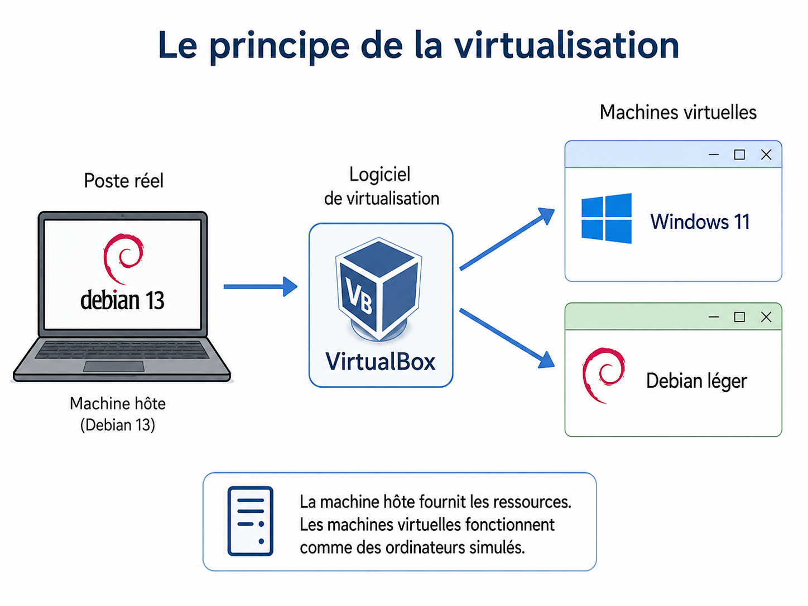
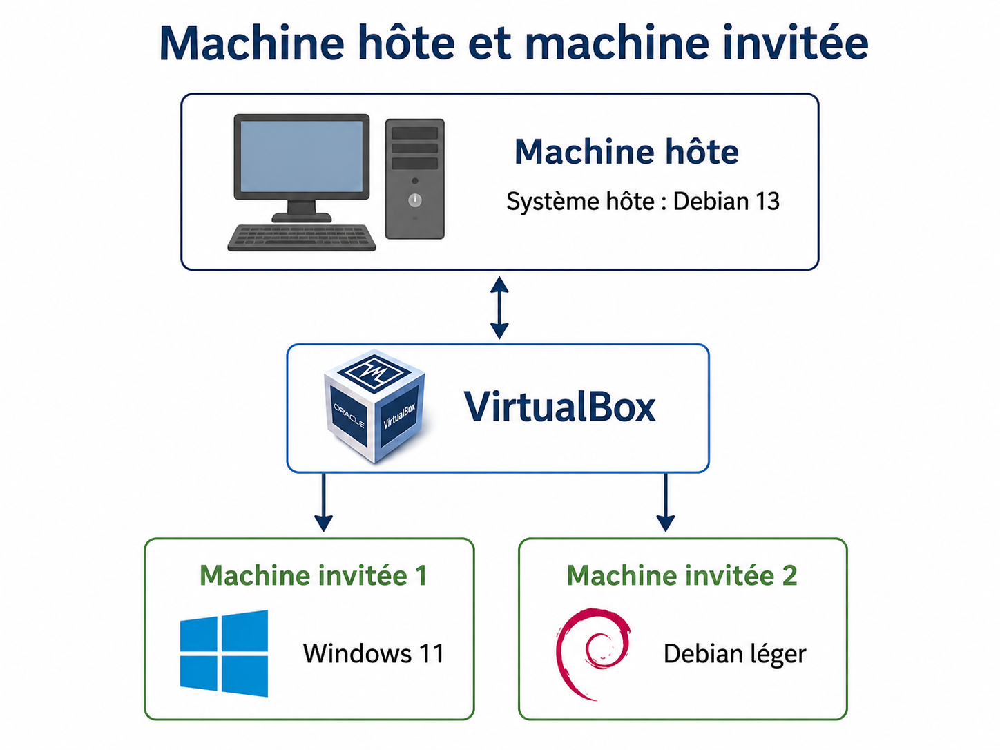
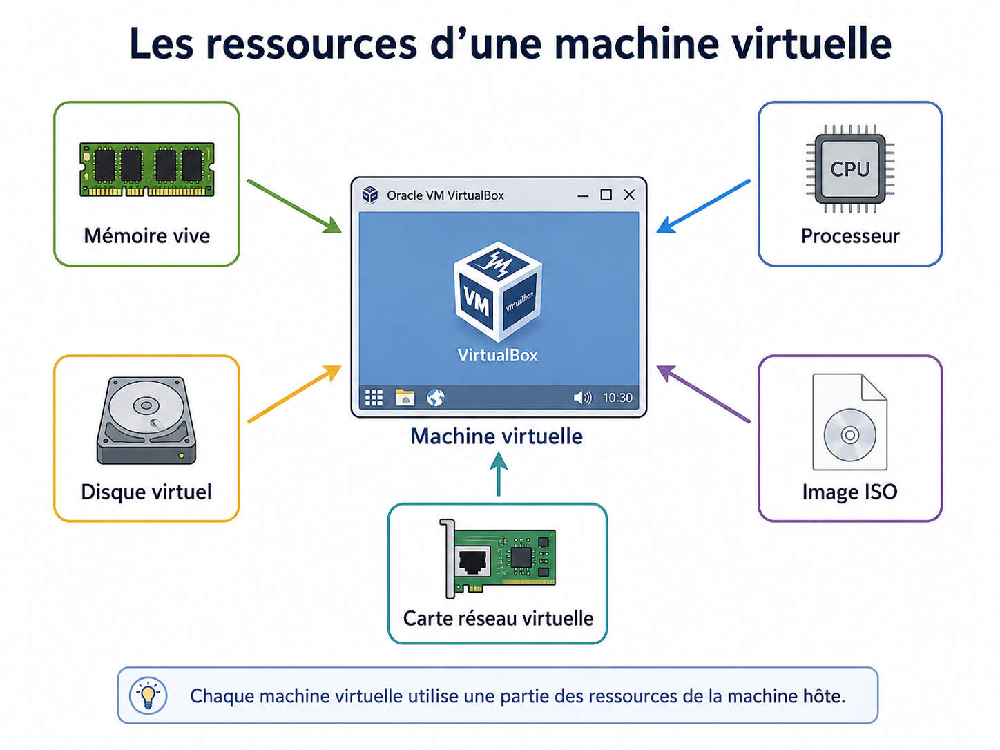
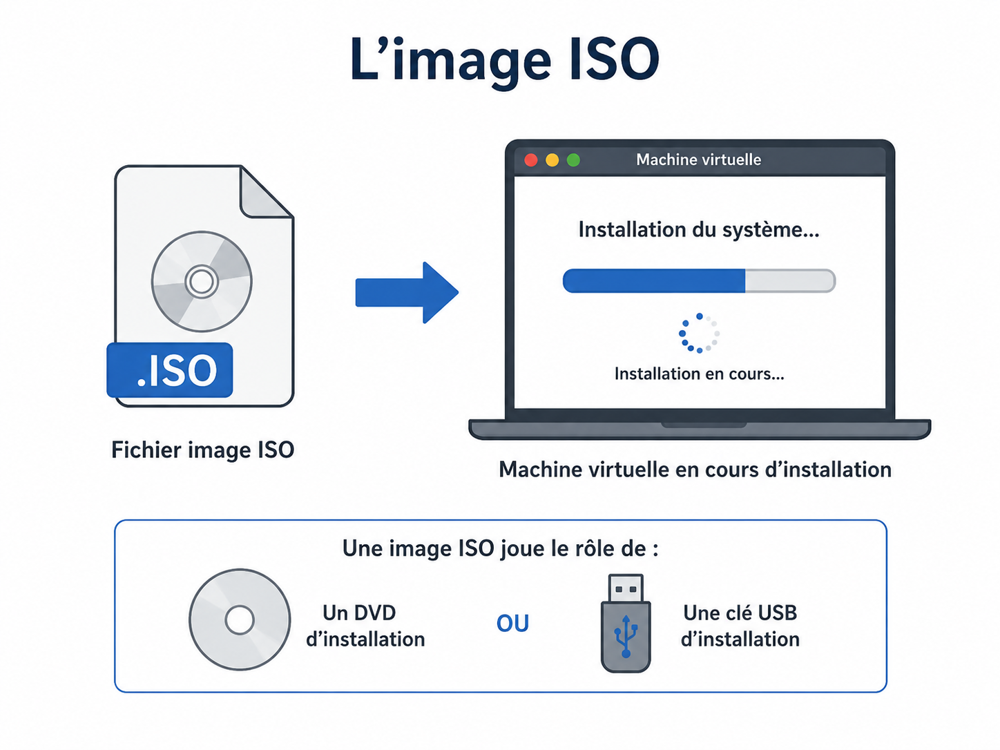
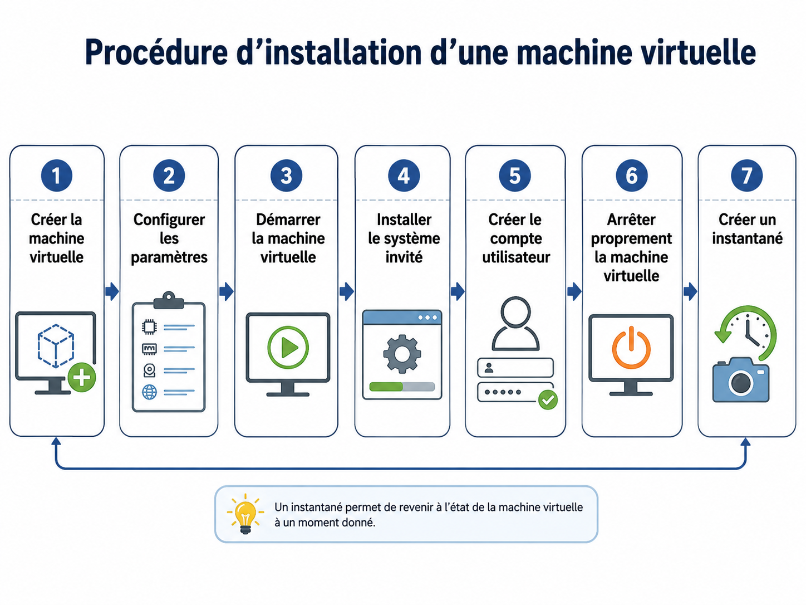
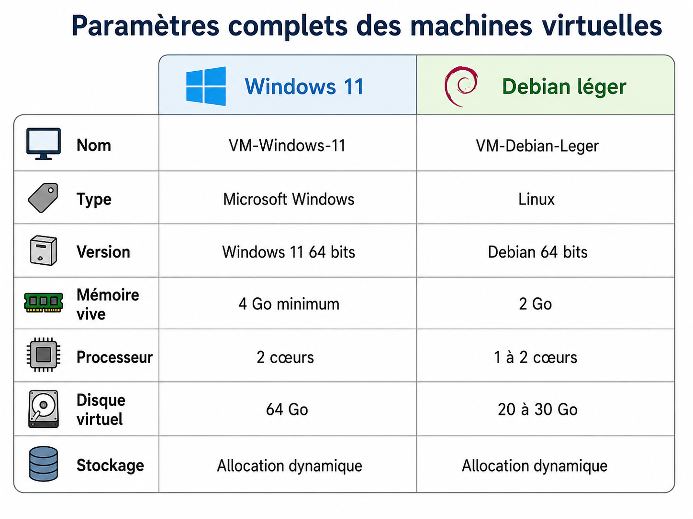
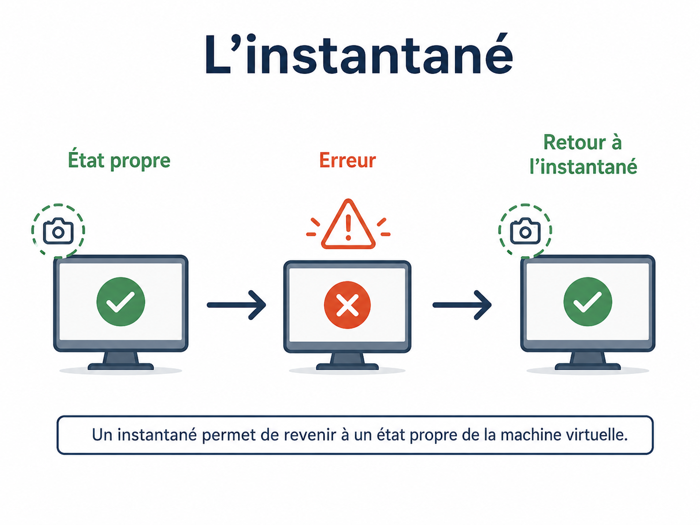
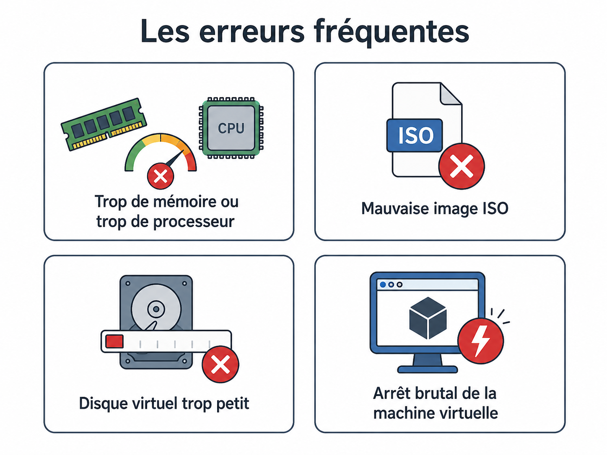

<!--
PAGE TEMPORAIRE - support de cours, sans aucune relation avec le framework Forge.
A SUPPRIMER le 2026-06-28 (voir docs/vacances/welcome-vacance.md).
-->

# Palier 2 : dossier technique

# Installer deux machines virtuelles avec VirtualBox

[Semaine réseau et virtualisation](/docs/forge/vacances/welcome-vacance/) <a href="javascript:void(0)" onclick="window.history.back()">Retour</a>

---

## Objectif du dossier technique

Ce dossier donne les connaissances nécessaires pour préparer et installer deux machines virtuelles avec VirtualBox.

À la fin de cette lecture, vous devez être capable de comprendre :

* ce qu’est une machine virtuelle ;
* ce qu’est une machine hôte ;
* ce qu’est une machine invitée ;
* le rôle de VirtualBox ;
* le rôle d’une image ISO ;
* le rôle d’un disque virtuel ;
* pourquoi il faut attribuer de la mémoire et du processeur à une machine virtuelle ;
* pourquoi les machines virtuelles doivent utiliser des identifiants communs en classe ;
* comment créer une machine virtuelle Windows 11 ;
* comment créer une machine virtuelle Debian légère ;
* pourquoi il faut créer un instantané après une installation propre.

---

## 1. Le principe de la virtualisation

La virtualisation permet de faire fonctionner un ordinateur simulé à l’intérieur d’un ordinateur réel.

L’ordinateur réel continue d’exister normalement.
La machine virtuelle fonctionne dans une fenêtre, comme si c’était un autre ordinateur.

Dans cette situation :

* la machine réelle est le poste Debian 13 ;
* VirtualBox est le logiciel utilisé pour créer les machines virtuelles ;
* les machines virtuelles à installer sont Windows 11 et Debian léger.

Une machine virtuelle peut être démarrée, arrêtée, configurée, supprimée ou restaurée sans modifier directement le système principal, si le travail est fait correctement.

  

---

## 2. Machine hôte et machine invitée

En virtualisation, il faut distinguer deux éléments.

| Élément         | Définition                                 |
| --------------- | ------------------------------------------ |
| Machine hôte    | Ordinateur réel qui exécute VirtualBox     |
| Système hôte    | Système installé sur l’ordinateur réel     |
| Machine invitée | Ordinateur simulé dans VirtualBox          |
| Système invité  | Système installé dans la machine virtuelle |

Dans notre cas :

| Rôle                       | Élément                        |
| -------------------------- | ------------------------------ |
| Machine hôte               | Poste de la salle              |
| Système hôte               | Debian 13                      |
| Logiciel de virtualisation | VirtualBox                     |
| Machine invitée 1          | Machine virtuelle Windows 11   |
| Machine invitée 2          | Machine virtuelle Debian léger |

La machine hôte fournit les ressources.
La machine invitée utilise une partie de ces ressources.

  

---

## 3. Le rôle de VirtualBox

VirtualBox est un logiciel de virtualisation.

Il permet de créer des machines virtuelles.

Chaque machine virtuelle possède ses propres éléments simulés :

* mémoire vive ;
* processeur ;
* disque dur ;
* carte réseau ;
* lecteur optique ;
* écran ;
* clavier ;
* souris.

VirtualBox ne remplace pas le système Debian 13.
Il fonctionne au-dessus de Debian 13.

Debian 13 reste le système principal du poste.

---

## 4. Les ressources d’une machine virtuelle

Une machine virtuelle utilise une partie des ressources de la machine réelle.

Ces ressources ne sont pas illimitées.

Si une machine virtuelle reçoit trop de mémoire ou trop de processeur, le poste Debian 13 peut devenir lent.

Il faut donc choisir des valeurs adaptées.

| Ressource              | Rôle                                                |
| ---------------------- | --------------------------------------------------- |
| Mémoire vive           | Permet au système invité de fonctionner             |
| Processeur             | Permet d’exécuter les instructions                  |
| Disque virtuel         | Stocke le système invité et ses fichiers            |
| Carte réseau virtuelle | Permet à la machine virtuelle de communiquer        |
| Lecteur ISO            | Permet de démarrer l’installation du système invité |

Une machine virtuelle doit avoir assez de ressources pour fonctionner, mais pas au point de bloquer la machine hôte.

  

---

## 5. La mémoire vive

La mémoire vive est souvent appelée RAM.

Quand on donne de la mémoire vive à une machine virtuelle, cette mémoire est prise sur celle de la machine hôte.

Exemple :

* le poste Debian 13 possède une certaine quantité de mémoire ;
* une partie est utilisée par Debian 13 ;
* une autre partie peut être attribuée à la machine virtuelle.

Si trop de mémoire est donnée à une machine virtuelle, Debian 13 peut ralentir fortement.

Il faut respecter les valeurs données dans ce dossier ou par le professeur.

---

## 6. Le processeur

VirtualBox permet d’attribuer un ou plusieurs cœurs de processeur à une machine virtuelle.

Plus une machine virtuelle reçoit de cœurs, plus elle peut être réactive.

Mais la machine hôte doit toujours garder assez de ressources pour fonctionner correctement.

Il ne faut donc pas attribuer tous les cœurs disponibles à une machine virtuelle.

---

## 7. Le disque virtuel

Une machine virtuelle utilise un disque virtuel.

Ce disque n’est pas un disque physique séparé.
C’est un fichier stocké sur la machine hôte.

Pour la machine virtuelle, ce fichier se comporte comme un vrai disque dur.

Le disque virtuel contient :

* le système installé ;
* les programmes ;
* les fichiers ;
* les paramètres de la machine virtuelle.

Il faut choisir une taille suffisante, mais raisonnable.

---

## 8. L’image ISO

Une image ISO est un fichier qui contient le programme d’installation d’un système d’exploitation.

Elle joue le même rôle qu’un DVD ou qu’une clé USB d’installation.

Dans VirtualBox, on peut utiliser une image ISO pour installer un système dans une machine virtuelle.

Pour ce palier, les images ISO nécessaires seront fournies ou indiquées par le professeur.

Il ne faut pas télécharger une image ISO au hasard.
Il faut utiliser l’image demandée pour l’activité.

  

---

## 9. Images ISO à utiliser

Les images ISO doivent être téléchargées depuis les sites officiels.

Il ne faut pas utiliser une image ISO trouvée au hasard sur Internet.

### 9.1 ISO Windows 11

Lien officiel Microsoft :

[Télécharger l’ISO Windows 11 depuis le site officiel Microsoft](https://www.microsoft.com/software-download/windows11)

Sur cette page, il faut chercher la partie correspondant à l’image disque ISO de Windows 11 pour les appareils x64.

L’ISO proposée par Microsoft est une ISO multi-édition.

Pour obtenir Windows 11 Famille, il faudra choisir l’édition correspondante pendant l’installation, si l’installateur le propose.

### 9.2 ISO Debian légère

Lien officiel Debian pour l’image netinst :

[Télécharger Debian netinst depuis le site officiel Debian](https://www.debian.org/download.fr.html)

L’image netinst est légère.

Elle installe le système à partir d’une petite image ISO, puis télécharge les éléments nécessaires pendant l’installation.

Pendant l’installation, il faudra choisir un environnement léger si un environnement graphique est demandé.

Choix conseillés :

* LXQt ;
* Xfce.

### 9.3 Alternative : image Debian live légère

Lien officiel Debian pour les images live :

[Consulter les images live Debian officielles](https://www.debian.org/CD/live/)

Une image live permet de démarrer Debian sans installation immédiate, puis d’installer le système depuis cette image.

Pour une machine virtuelle légère, choisir de préférence une version avec :

* Xfce ;
* LXDE ;
* LXQt si disponible.

### 9.4 Règle à respecter

Les images ISO utilisées en classe doivent être celles indiquées par le professeur.

Si l’image ISO est déjà présente sur le poste, il ne faut pas en télécharger une autre sans consigne.

Si l’image ISO est absente, il faut demander au professeur quel fichier utiliser.

---

## 10. Identifiants à utiliser pour les machines virtuelles

Pour cette activité, les machines virtuelles doivent utiliser des identifiants communs.

Cela permet au professeur d’ouvrir rapidement une machine virtuelle si une vérification ou une correction est nécessaire.

Ces identifiants sont utilisés uniquement pour les machines virtuelles de classe.

Ils ne doivent jamais être utilisés pour un compte personnel, un compte de l’établissement ou un service accessible sur Internet.

| Élément                        | Valeur à utiliser |
| ------------------------------ | ----------------- |
| Nom d’utilisateur              | tne               |
| Mot de passe                   | Tne2026!          |
| Indice de mot de passe Windows | classe            |

Pour Debian, si l’installation demande un nom complet, utiliser :

| Élément                                 | Valeur à utiliser |
| --------------------------------------- | ----------------- |
| Nom complet                             | Utilisateur TNE   |
| Nom d’utilisateur                       | tne               |
| Mot de passe                            | Tne2026!          |
| Mot de passe administrateur, si demandé | Tne2026!          |

Si l’installation de Windows demande obligatoirement un compte Microsoft, ne pas utiliser de compte personnel.

Dans ce cas, il faut appeler le professeur.

---

## 11. La machine virtuelle Windows 11

La première machine virtuelle à installer sera une machine virtuelle Windows 11.

Elle servira à observer le fonctionnement d’un système Windows dans VirtualBox.

Cette machine virtuelle devra être créée avec les paramètres indiqués dans ce dossier.

Les points importants à vérifier sont :

* le nom de la machine virtuelle ;
* le type de système ;
* l’image ISO utilisée ;
* la mémoire attribuée ;
* le nombre de cœurs processeur ;
* la taille du disque virtuel ;
* le démarrage correct de l’installation ;
* la création du compte utilisateur ;
* l’arrêt propre de la machine virtuelle après installation ;
* la création d’un instantané.

Windows 11 peut demander une configuration plus stricte qu’une distribution Linux.

Il faut donc suivre les consignes et ne pas modifier les paramètres au hasard.

---

## 12. Paramètres complets pour la machine virtuelle Windows 11

Utiliser les paramètres suivants, sauf consigne différente du professeur.

| Paramètre                   | Valeur à utiliser                  |
| --------------------------- | ---------------------------------- |
| Nom de la machine virtuelle | VM-Windows-11                      |
| Type                        | Microsoft Windows                  |
| Version                     | Windows 11 64 bits                 |
| Image ISO                   | ISO Windows 11 fournie ou indiquée |
| Mémoire vive                | 4 Go minimum                       |
| Processeur                  | 2 cœurs                            |
| Disque virtuel              | 64 Go                              |
| Type de disque              | VDI                                |
| Stockage                    | Allocation dynamique               |
| Carte réseau                | NAT pendant l’installation         |
| EFI                         | Activé                             |
| TPM                         | Activé si disponible               |
| Secure Boot                 | Activé si disponible               |
| Mémoire vidéo               | 128 Mo si disponible               |

Windows 11 demande plus de ressources qu’une distribution Linux légère.

Si le poste devient lent, il faut fermer les applications inutiles et prévenir le professeur.

---

## 13. Procédure d’installation de Windows 11 dans VirtualBox

### 13.1 Créer la machine virtuelle

Dans VirtualBox :

1. créer une nouvelle machine virtuelle ;
2. nommer la machine : VM-Windows-11 ;
3. choisir le type : Microsoft Windows ;
4. choisir la version : Windows 11 64 bits ;
5. sélectionner l’image ISO Windows 11 ;
6. attribuer la mémoire vive demandée ;
7. attribuer le nombre de processeurs demandé ;
8. créer le disque virtuel ;
9. vérifier les paramètres ;
10. démarrer la machine virtuelle.

### 13.2 Lancer l’installation

Au démarrage de la machine virtuelle :

1. attendre le lancement de l’installateur Windows ;
2. choisir la langue demandée ;
3. choisir le clavier adapté ;
4. lancer l’installation ;
5. choisir l’édition demandée si l’installateur le propose ;
6. accepter les conditions si elles sont demandées ;
7. choisir une installation personnalisée si l’installateur le demande ;
8. sélectionner le disque virtuel vide ;
9. lancer l’installation ;
10. attendre les redémarrages automatiques.

Pendant l’installation, il ne faut pas éteindre brutalement la machine virtuelle.

### 13.3 Créer le compte utilisateur

Lorsque Windows demande la création du compte, utiliser les informations imposées pour l’activité.

| Élément                | Valeur   |
| ---------------------- | -------- |
| Nom d’utilisateur      | tne      |
| Mot de passe           | Tne2026! |
| Indice de mot de passe | classe   |

Si Windows demande un compte Microsoft et ne propose pas de compte local, ne pas utiliser de compte personnel.

Il faut appeler le professeur.

### 13.4 Terminer l’installation

Après la création du compte :

1. attendre l’arrivée sur le bureau Windows ;
2. vérifier que la session s’ouvre avec le compte demandé ;
3. arrêter proprement Windows ;
4. revenir dans VirtualBox ;
5. créer un instantané nommé : Installation propre.

La machine virtuelle Windows 11 est prête lorsque :

* elle démarre correctement ;
* le compte demandé fonctionne ;
* l’arrêt se fait correctement ;
* l’instantané Installation propre existe.

  

---

## 14. La machine virtuelle Debian légère

La deuxième machine virtuelle à installer sera une machine virtuelle avec Debian léger.

Elle servira à comparer le fonctionnement d’un système Linux avec celui de Windows 11 dans VirtualBox.

Cette machine virtuelle devra aussi être créée avec les paramètres indiqués dans ce dossier.

Les points importants à vérifier sont :

* le nom de la machine virtuelle ;
* le type de système ;
* l’image ISO utilisée ;
* la mémoire attribuée ;
* le nombre de cœurs processeur ;
* la taille du disque virtuel ;
* le démarrage correct de l’installation ;
* la création du compte utilisateur ;
* l’arrêt propre de la machine virtuelle après installation ;
* la création d’un instantané.

Une machine virtuelle Debian légère demande généralement moins de ressources qu’une machine virtuelle Windows 11.

Elle permet de faire des tests rapidement.

---

## 15. Paramètres complets pour la machine virtuelle Debian légère

Utiliser les paramètres suivants, sauf consigne différente du professeur.

| Paramètre                         | Valeur à utiliser              |
| --------------------------------- | ------------------------------ |
| Nom de la machine virtuelle       | VM-Debian-Leger                |
| Type                              | Linux                          |
| Version                           | Debian 64 bits                 |
| Image ISO                         | ISO Debian fournie ou indiquée |
| Mémoire vive                      | 2 Go                           |
| Processeur                        | 1 ou 2 cœurs                   |
| Disque virtuel                    | 20 Go à 30 Go                  |
| Type de disque                    | VDI                            |
| Stockage                          | Allocation dynamique           |
| Carte réseau                      | NAT pendant l’installation     |
| Mémoire vidéo                     | 64 Mo à 128 Mo                 |
| Environnement graphique conseillé | Xfce ou LXQt                   |

Debian léger demande moins de ressources que Windows 11.

Il est donc plus adapté aux tests rapides et aux manipulations réseau.

  

---

## 16. Procédure d’installation de Debian léger dans VirtualBox

### 16.1 Créer la machine virtuelle

Dans VirtualBox :

1. créer une nouvelle machine virtuelle ;
2. nommer la machine : VM-Debian-Leger ;
3. choisir le type : Linux ;
4. choisir la version : Debian 64 bits ;
5. sélectionner l’image ISO Debian ;
6. attribuer la mémoire vive demandée ;
7. attribuer le nombre de processeurs demandé ;
8. créer le disque virtuel ;
9. vérifier les paramètres ;
10. démarrer la machine virtuelle.

### 16.2 Lancer l’installation

Au démarrage de la machine virtuelle :

1. choisir l’installation graphique ou l’installation classique selon la consigne du professeur ;
2. choisir la langue ;
3. choisir le pays ;
4. choisir le clavier ;
5. laisser l’installateur détecter le matériel virtuel ;
6. configurer le nom de la machine si demandé.

Nom conseillé pour la machine Debian :

| Élément        | Valeur     |
| -------------- | ---------- |
| Nom de machine | debian-tne |

### 16.3 Créer les comptes

Lorsque l’installateur demande les identifiants, utiliser les valeurs imposées.

| Élément                                 | Valeur          |
| --------------------------------------- | --------------- |
| Nom complet                             | Utilisateur TNE |
| Nom d’utilisateur                       | tne             |
| Mot de passe utilisateur                | Tne2026!        |
| Mot de passe administrateur, si demandé | Tne2026!        |

Il faut écrire le mot de passe avec attention.

Une erreur dans le mot de passe empêchera l’ouverture de session.

### 16.4 Partitionner le disque virtuel

Pour cette activité, utiliser le choix simple proposé par l’installateur.

Choix conseillé :

* utiliser tout le disque ;
* partitionnement assisté ;
* tous les fichiers dans une seule partition.

Attention : cela concerne uniquement le disque virtuel de la machine virtuelle.

Cela ne doit pas effacer le disque réel de la machine hôte.

### 16.5 Choisir les logiciels

Si l’installateur demande les logiciels à installer, choisir une configuration légère.

Choix conseillés :

* environnement de bureau Xfce ou LXQt ;
* utilitaires usuels du système ;
* serveur SSH uniquement si le professeur le demande.

Éviter les environnements trop lourds si le professeur demande une machine légère.

### 16.6 Terminer l’installation

À la fin de l’installation :

1. terminer l’installation ;
2. redémarrer la machine virtuelle ;
3. ouvrir la session avec le compte tne ;
4. vérifier que le bureau s’affiche correctement ;
5. arrêter proprement Debian ;
6. revenir dans VirtualBox ;
7. créer un instantané nommé : Installation propre.

La machine virtuelle Debian est prête lorsque :

* elle démarre correctement ;
* le compte demandé fonctionne ;
* l’arrêt se fait correctement ;
* l’instantané Installation propre existe.

---

## 17. Nommer correctement les machines virtuelles

Le nom d’une machine virtuelle doit être clair.

Un bon nom permet de savoir immédiatement à quoi correspond la machine.

Exemples de noms clairs :

| Machine virtuelle | Exemple de nom  |
| ----------------- | --------------- |
| Windows 11        | VM-Windows-11   |
| Debian léger      | VM-Debian-Leger |

Un nom trop vague est à éviter.

Exemples de noms à éviter :

* test ;
* machine ;
* truc ;
* nouvelle VM ;
* windows final vrai.

Un nom propre permet de retrouver facilement la machine virtuelle dans VirtualBox.

---

## 18. Démarrer et arrêter une machine virtuelle

Une machine virtuelle doit être arrêtée correctement.

Il ne faut pas fermer brutalement la fenêtre de la machine virtuelle sans comprendre ce que l’on fait.

Pour arrêter correctement une machine virtuelle, il faut utiliser l’arrêt du système invité.

Exemples :

* dans Windows 11 : menu démarrer, puis arrêt ;
* dans Debian : menu d’arrêt ou commande adaptée.

Si la machine virtuelle est arrêtée brutalement, le système invité peut être endommagé.

---

## 19. L’instantané

Un instantané est une sauvegarde de l’état d’une machine virtuelle à un moment précis.

Le mot anglais souvent utilisé dans VirtualBox est “snapshot”.

Dans ce dossier, on utilise le mot français : instantané.

Un instantané permet de revenir à un état précédent.

Exemple :

1. la machine virtuelle vient d’être installée proprement ;
2. un instantané est créé ;
3. une erreur est faite plus tard ;
4. l’instantané permet de revenir à l’état propre.

L’instantané est très utile en apprentissage.

Il permet de faire des essais sans tout recommencer depuis le début.

  

---

## 20. Quand créer un instantané

Il faut créer un instantané lorsque la machine virtuelle est dans un état propre et stable.

Dans cette activité, l’instantané doit être créé après l’installation correcte du système invité.

L’instantané doit avoir un nom clair.

| Machine virtuelle | Nom de l’instantané |
| ----------------- | ------------------- |
| Windows 11        | Installation propre |
| Debian léger      | Installation propre |

Un nom clair permet de savoir à quel moment on peut revenir.

---

## 21. Les erreurs fréquentes

### 21.1 Donner trop de mémoire à une machine virtuelle

Si la machine virtuelle reçoit trop de mémoire, la machine hôte peut devenir lente.

Il faut respecter la valeur demandée dans ce dossier ou par le professeur.

### 21.2 Choisir le mauvais type de système

VirtualBox demande le type de système à installer.

Si le mauvais type est choisi, l’installation peut être plus difficile ou mal configurée.

Il faut choisir le type correspondant au système invité.

### 21.3 Utiliser la mauvaise image ISO

Une mauvaise image ISO peut empêcher l’installation.

Il faut utiliser l’image indiquée par le professeur.

### 21.4 Créer un disque virtuel trop petit

Si le disque virtuel est trop petit, l’installation peut échouer ou manquer d’espace rapidement.

Il faut respecter la taille demandée dans ce dossier ou par le professeur.

### 21.5 Éteindre brutalement la machine virtuelle

Une fermeture brutale peut provoquer des erreurs dans le système invité.

Il faut arrêter proprement la machine virtuelle.

### 21.6 Oublier de créer l’instantané

Si aucun instantané n’est créé après une installation propre, il sera plus difficile de revenir en arrière en cas d’erreur.

L’instantané fait partie du travail demandé.

### 21.7 Utiliser un identifiant personnel

Il ne faut pas utiliser d’identifiant personnel dans les machines virtuelles de cette activité.

Les machines virtuelles doivent utiliser les identifiants communs de classe.

---

## 22. Vérification finale avant le palier 3

Avant de passer au palier 3, les deux machines virtuelles doivent être prêtes.

| Vérification                            | Windows 11 | Debian léger |
| --------------------------------------- | ---------- | ------------ |
| La machine virtuelle existe             | Oui        | Oui          |
| Elle démarre correctement               | Oui        | Oui          |
| Le compte tne fonctionne                | Oui        | Oui          |
| Le mot de passe commun fonctionne       | Oui        | Oui          |
| La machine s’arrête proprement          | Oui        | Oui          |
| L’instantané Installation propre existe | Oui        | Oui          |

Le palier 2 est terminé lorsque les deux machines virtuelles sont installées, accessibles avec les identifiants demandés et sauvegardées par un instantané.

---

## 23. Ce qu’il faut retenir

VirtualBox permet de créer des machines virtuelles.

La machine hôte est le poste réel sous Debian 13.

La machine invitée est la machine virtuelle créée dans VirtualBox.

Une machine virtuelle utilise des ressources de la machine hôte :

* mémoire vive ;
* processeur ;
* disque ;
* carte réseau virtuelle.

Une image ISO sert à installer un système d’exploitation.

Un disque virtuel contient le système invité et ses fichiers.

Les machines virtuelles de classe utilisent des identifiants communs afin que le professeur puisse les vérifier.

Un instantané permet de revenir à un état propre.

Les machines virtuelles doivent être nommées clairement, configurées proprement et arrêtées correctement.

  

---

!!! info "Activité à réaliser"

    Vous avez maintenant les informations nécessaires pour passer à la partie pratique.

    Important : vous commencez par le QCM. Vous ne démarrez l’activité que lorsque votre QCM est validé à 100 %.

    Marche à suivre :

    1. [Télécharger le QCM du palier 2](/docs/forge/vacances/palier-2/qcm-palier-2-machines-virtuelles.pdf), puis répondez à toutes les questions.
    2. Faites valider votre QCM. Tant qu’il n’est pas correct à 100 %, vous ne passez pas à l’activité.
    3. Une fois le QCM validé à 100 %, [télécharger l’activité : installer deux machines virtuelles avec VirtualBox](/docs/forge/vacances/palier-2/activite-machines-virtuelles-virtualbox.pdf) et réalisez les étapes demandées.

    Pendant l’activité, vous devrez revenir dans ce dossier technique chaque fois que vous aurez besoin d’une information.
