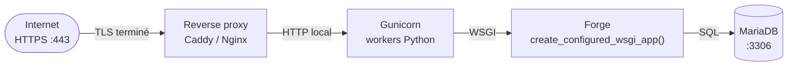

# Déploiement WSGI minimal

[Accueil](index.md) <a href="javascript:void(0)" onclick="window.history.back()">Retour</a>

Cette page documente le chemin **WSGI minimal** pour exposer une application
Forge en production, derrière un serveur WSGI externe (Gunicorn) et un
reverse proxy (Caddy ou Nginx).

!!! warning "`python app.py` n'est pas pour la production publique"
    Le serveur `ThreadingHTTPServer` lancé par `python app.py` est conçu
    pour le développement local, les tests et les démonstrations. Il ne
    gère pas correctement la concurrence à grande échelle, le keep-alive,
    les timeouts ou la compression. **Pour une exposition publique,
    utiliser obligatoirement le chemin WSGI documenté ci-dessous**, derrière
    un reverse proxy.

Voir aussi : [Guide de déploiement](deployment.md) et
[Sécurité en production](production-security.md).

---

## 1. Architecture cible



Trois responsabilités sont séparées :

- **Reverse proxy** : TLS, fichiers statiques, headers de sécurité, `X-Real-IP`.
- **Gunicorn** : pool de workers Python, gestion du cycle de vie.
- **Forge** : dispatch des routes via le callable WSGI.

---

## 2. Fichier `wsgi.py` applicatif

À placer à la racine du projet applicatif Forge :

```python
# wsgi.py
from core.wsgi import create_configured_wsgi_app

application = create_configured_wsgi_app()
```

La factory `create_configured_wsgi_app()` :

- charge la même configuration que `python app.py` (via `core.app_factory.build_application`) ;
- applique `forge.configure(...)` avec toutes les variables d'environnement
  (dont `APP_TRUSTED_PROXIES`) ;
- enregistre le renderer Jinja2 ;
- charge le router applicatif depuis `APP_ROUTES_MODULE` ;
- émet une fois — à la construction — les
  [avertissements production](#6-warnings-production-au-demarrage),
  jamais à chaque requête.

---

## 3. Lancement Gunicorn

Forge **n'embarque pas Gunicorn** : c'est une dépendance à installer
séparément côté projet applicatif.

```bash
pip install gunicorn
gunicorn wsgi:application --bind 127.0.0.1:8000
```

Notes :

- Gunicorn écoute uniquement sur la boucle locale (`127.0.0.1`) — le reverse
  proxy s'occupe d'exposer HTTPS publiquement ;
- pour un démarrage type production, ajouter `--workers <N>` adapté au CPU
  disponible. **Voir la note multi-worker en [§7](#7-limites-actuelles-en-production)**.

---

## 4. Reverse proxy

### Caddy (recommandé pour la simplicité TLS)

```caddy
forgemvc.example {
    reverse_proxy 127.0.0.1:8000 {
        header_up X-Real-IP {remote_host}
    }
}
```

### Nginx (variante équivalente)

```nginx
server {
    listen 443 ssl;
    server_name forgemvc.example;
    # ... ssl_certificate / ssl_certificate_key ...

    location / {
        proxy_pass http://127.0.0.1:8000;
        proxy_set_header Host $host;
        proxy_set_header X-Real-IP $remote_addr;
    }
}
```

Les fichiers statiques (`/static/...`) et les médias (`/media/...`) peuvent
être servis directement par le reverse proxy pour soulager Gunicorn — voir
[§7](#7-limites-actuelles-en-production).

---

## 5. `APP_TRUSTED_PROXIES` et `X-Real-IP`

Sans configuration explicite, **Forge ignore `X-Real-IP`** et utilise
toujours l'adresse IP observée au niveau du socket TCP. Pour activer la
résolution de l'IP réelle du client derrière un reverse proxy, déclarer la
ou les IPs de confiance :

```bash
APP_TRUSTED_PROXIES=127.0.0.1
```

ou pour plusieurs proxies (espaces tolérés) :

```bash
APP_TRUSTED_PROXIES=127.0.0.1, ::1, 10.0.0.5
```

Règles :

- **vide par défaut** → `X-Real-IP` toujours ignoré ;
- **liste séparée par virgules**, espaces tolérés ;
- **comparaison IP exacte** — pas de notation CIDR ;
- **pas de wildcard** ;
- `0.0.0.0` n'a aucune signification spéciale (il ne couvre que `0.0.0.0`) ;
- `X-Real-IP` est ignoré si la requête arrive depuis une IP non listée ;
- une valeur invalide dans `X-Real-IP` est ignorée — Forge retombe sur
  l'IP du socket.

Ticket de référence : `HTTP-TRUSTED-PROXY-IP-001`.

---

## 6. Warnings production au démarrage

`create_configured_wsgi_app()` émet — **une seule fois, à la construction
de l'application, jamais par requête** — un avertissement si Forge est
configuré en `APP_ENV=prod` avec un store de session mémoire :

```
AVERTISSEMENT-PROD — Forge tourne en APP_ENV=prod avec stockage mémoire.
  * Sessions : MemorySessionStore est volatile et mono-processus.
  * Rate-limit (login, uploads) : compteurs en mémoire non partagés.
Tolérée pour développement/test, cette configuration est fragile en
production. Configurer un session store partagé avant exposition
publique (ex. forge.configure(session_store=FileSessionStore(...))).
```

Pour silencer le warning dans les tests :

```python
application = create_configured_wsgi_app(emit_prod_warnings=False)
```

Pour rediriger le warning vers un logger applicatif :

```python
import logging
application = create_configured_wsgi_app(
    logger=logging.getLogger("my_app.startup"),
)
```

Tickets de référence : `AUTH-RATE-LIMIT-PROD-WARNING-001`,
`WSGI-PROD-WARNINGS-001`.

---

## 7. Limites actuelles en production

Ce guide est un **socle minimal**, pas une recette d'exploitation
complète. Les limites suivantes restent à la charge de l'opérateur :

- **Session store mémoire** (`MemorySessionStore`) : volatile au
  redémarrage, mono-processus. Utiliser `FileSessionStore` ou
  `MariaDbSessionStore` (voir [ADR-002](adr/002-session-strategy.md))
  via `forge.configure(session_store=...)`.
- **`FileSessionStore`** : utilisable, mais reste fragile en multi-worker
  (pas de verrou partagé strict). Pour un déploiement multi-worker fiable,
  privilégier `MariaDbSessionStore`.
- **Rate-limits login/upload encore en mémoire** : compteurs non partagés
  entre workers Gunicorn. La protection reste utile mais n'est pas
  distribuée.
- **Multi-worker** : Forge émet déjà un avertissement supplémentaire au
  démarrage `python app.py` si `WEB_CONCURRENCY > 1` ou si
  `SERVER_SOFTWARE` contient `gunicorn`/`uwsgi`. Lire ce warning au
  premier démarrage Gunicorn.
- **Fichiers statiques (`/static/...`)** : faire servir directement par le
  reverse proxy, plus rapide et plus sûr qu'un dispatch Python.
- **Médias (`/media/...`)** : à cadrer selon l'application — `app.py`
  fournit `serve_media_file` mais le chemin WSGI minimal ne le gère pas
  automatiquement.
- **HTTPS** : à terminer **côté reverse proxy**. Le pipeline Gunicorn ↔
  Forge reste en HTTP local sur `127.0.0.1`.
- **Pas de support `X-Forwarded-For`** : seul `X-Real-IP` est honoré, et
  uniquement derrière un proxy de confiance.
- **Pas de notation CIDR pour `APP_TRUSTED_PROXIES`** : seules les IPs
  exactes sont acceptées.
- **Aucune génération automatique** du fichier `wsgi.py` applicatif :
  c'est à l'utilisateur de le créer (voir [§2](#2-fichier-wsgipy-applicatif)).

Pour une vue d'ensemble des limites de production hors WSGI, voir le
futur ticket `DOCS-PRODUCTION-LIMITS-001`.
